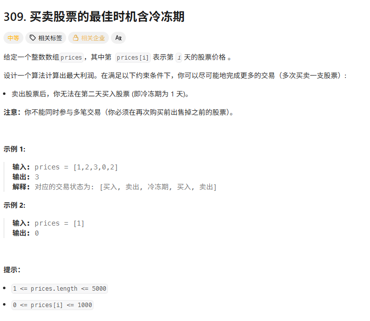
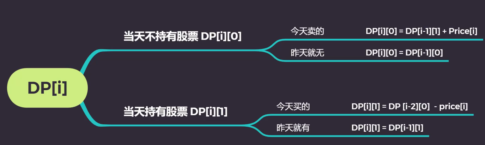

# Leetcode算法

## 309. 最佳买卖股票时机含冷冻期

动态规划：

- 状态【dp数组的内容】：当天晚上不持有股票`dp[n][0]`和当天晚上持有股票`dp[n][1]`的最大收益

- 状态转移：
  - 当天晚上不持有股票：(取MAX)
    - 今天刚卖出：来源于【昨天晚上有股票】， `dp[i-1][1] + price[i]`
    - 昨天就没有：来源于【昨天晚上没有股票】，`dp[i-1][0]`
  - 当天晚上持有股票：(取MAX)
    - 今天刚买入：来源于【**前天晚上没有股票（无论是因为前天刚卖出、还是大前天没有，反正前天晚上不持有股票，可以使得今天买入）**】， `dp[i-2][0]`
    - 昨天就有：来源于【昨天晚上持有股票】， `dp[i-1][1]`

- 边界条件：由于`dp[i]`依赖于`dp[i-1]`以及`dp[i-2]`，故从小索引查找边界，并从小索引开始遍历。
  - `dp[0][0] = 0`
  - `dp[0][1] = -price[0]`