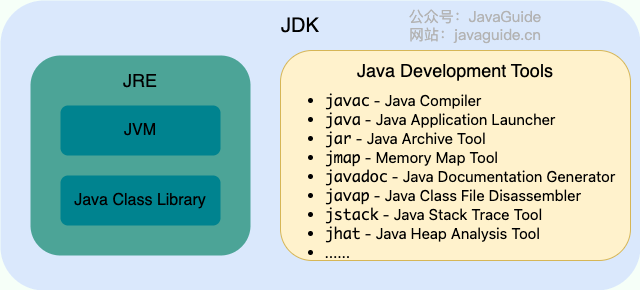
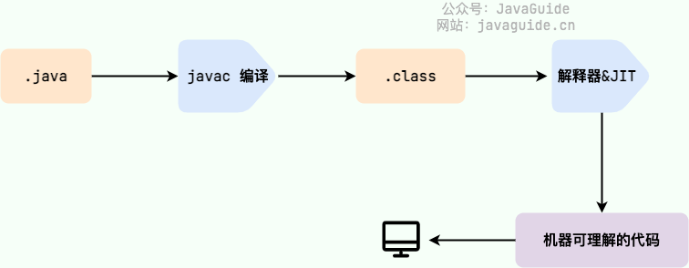
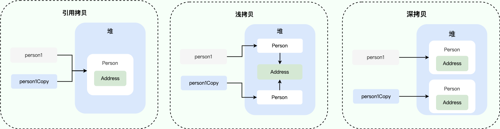
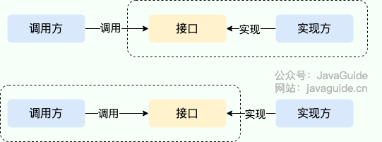
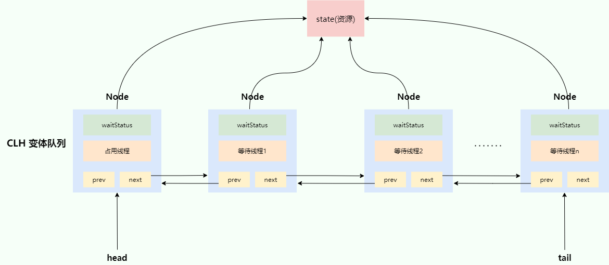
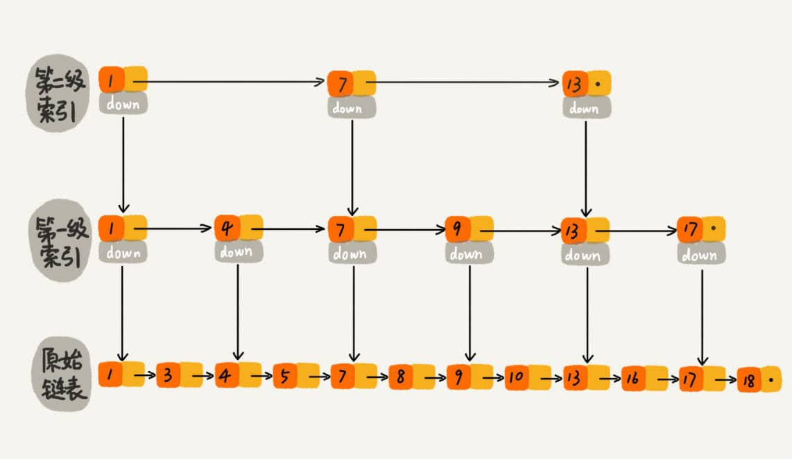
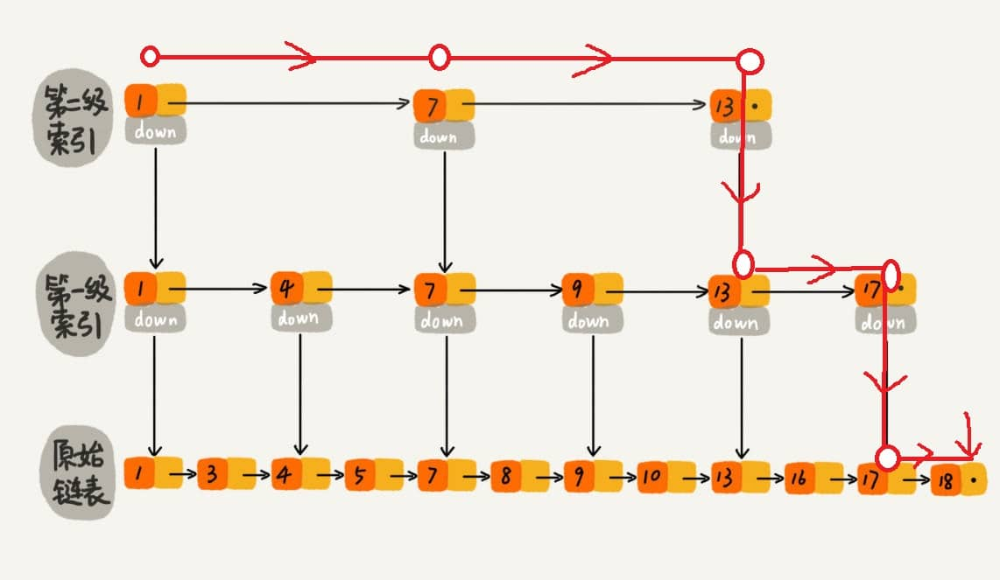
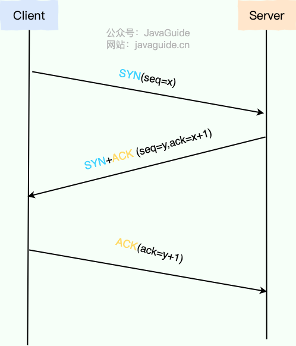

# Java 八股

## Java基础

### JVM vs JDK vs JRE

#### JVM

Java 虚拟机（Java Virtual Machine, JVM）是运行 Java 字节码的虚拟机。**其是一种规范，每个公司、组织或个人都可以开发自己专属的JVM**。JVM是Java实现“一次编译，随处运行”的关键所在。

如下图所示，**不同编程语言**（Java、Groovy、Kotlin、JRuby、Clojure ...）通过各自的编译器编译成 `.class` 文件，并最终**通过 JVM** 在**不同平台（Windows、Mac、Linux）上运行**。


#### JDK 和 JRE

JDK（Java Development Kit）是一个功能齐全的 Java 开发工具包。它包含了 JRE（Java Runtime Environment），以及编译器 javac 和其他工具，如 javadoc（文档生成器）、jdb（调试器）、jconsole（监控工具）、javap（反编译工具）等。

JRE 是运行**已编译 Java 程序**所需的环境，主要包含以下两个部分：

- JVM
- Java基础类库（Class Library）：类似C语言的核心库

下图清晰展示了 JDK、JRE 和 JVM 的关系。



不过，从 **JDK 9** 开始，就不需要区分 JDK 和 JRE 的关系了，取而代之的是**模块系统**（JDK 被重新组织成 94 个模块）+ [jlink](http://openjdk.java.net/jeps/282) 工具 (随 Java 9 一起发布的新命令行工具，用于生成自定义 Java 运行时映像，该映像仅**包含给定应用程序所需的模块**) 

Java 应用可以通过新增的 **jlink 工具**，创建出只包含所依赖的 JDK 模块的**自定义运行时镜像**。这样可以极大的减少 Java 运行时环境的大小。

### 字节码

在 Java 中，JVM 可以理解的代码就叫做字节码（即扩展名为 `.class` 的文件），它不面向任何特定的处理器，只面向虚拟机。

Java程序从源代码到运行的过程如下图所示：



需要注意`.class->机器码`这一步，在这一步中JVM类加载器首先加载字节码文件，然后通过解释器逐行解释执行。而有些方法和代码块是经常需要被调用的（也就是所谓的**热点代码**），故引入了**JIT(Just in Time Compilation)**编译器。当JIT编译器完成第一次编译后，会将字节码对应的机器码保存下来，下次可以直接使用。


>HotSpot 采用了惰性评估(Lazy Evaluation)的做法，根据二八定律，消耗大部分系统资源的只有那一小部分的代码（热点代码），而这也就是 JIT 所需要编译的部分。JVM 会根据代码每次被执行的情况收集信息并相应地做出一些优化，因此执行的次数越多，它的速度就越快。

JDK、JRE、JVM、JIT 这四者的关系如下图所示。


### Java语言“编译与解释并存”

我们可以将高级编程语言按照程序的执行方式分为两种：

- **编译型**：**编译型语言**会通过**编译器**将源代码**一次性**翻译成可被该平台执行的机器码。一般情况下，编译语言的执行速度比较快，开发效率比较低。常见的编译性语言有 C、C++、Go、Rust 等等。

- **解释型**：[解释型语言](https://zh.wikipedia.org/wiki/直譯語言)会通过[解释器](https://zh.wikipedia.org/wiki/直譯器)**一句一句**的将代码解释（interpret）为机器代码后再执行。解释型语言开发效率比较快，执行速度比较慢。常见的解释性语言有 Python、JavaScript、PHP 等等。

而由于**JIT(即时编译)**技术的出现，使得Java先把源代码**编译**成**字节码**，到执行时再将**字节码**由**Java解释器**来解释执行；故Java语言**既具有编译型语言的特征，也具有解释型语言的特征。**

### AOP

JDK 9 引入了一种新的编译模式 **AOT(Ahead of Time Compilation)** 。和 JIT 不同的是，这种编译模式会在程序被执行前就将其编译成机器码，属于静态编译（C、 C++，Rust，Go 等语言就是静态编译）；可以减少内存占用、开销和提高启动速度，特别适合云原生场景。

然而，AOT直接将源代码编译成机器码，导致无法使用字节码的特性（如反射、动态代理、动态加载、等），导致许多现有框架和库（如Spring、CGLIB）无法使用，因此，AOP技术虽有优势，但无法代替JIT编译。

### Java与C++区别

虽然，Java 和 C++ 都是面向对象的语言，都支持封装、继承和多态，但是，它们还是有挺多不相同的地方：

- Java **不提供指针**来直接访问内存，程序内存更加安全
- Java 的类是**单继承**的，C++ 支持**多重继承**；虽然 Java 的类不可以多继承，但是接口可以多继承。
- Java 有**自动内存管理垃圾回收机制(GC)**，不需要程序员手动释放无用内存。
- C ++同时支持**方法重载和操作符重载**，但是 Java 只支持**方法重载**（操作符重载增加了复杂性，这与 Java 最初的设计思想不符）。
- 。。。。

### 浅拷贝 VS 深拷贝

区别如下：

- **浅拷贝**：浅拷贝会在堆上创建一个新的对象（区别于引用拷贝的一点），不过，如果原对象内部的属性是**引用类型**的话，浅拷贝会**直接复制内部对象的引用地址**（即，如果包含对象指针，则复制指针；故指向同一个对象），也就是说拷贝对象和原对象共用同一个内部对象。

- **深拷贝**：深拷贝会完全复制整个对象，包括这个对象所指向的其他对象；即**重新创建**一个**指针指向的对象**并复制



### Java序列化

**Kryo** 是专门针对**java语言**序列化方式并且性能非常好；速度快且体积小；

Protobuf、ProtoStuff、hessian都是**跨语言**的序列化方式。

### 反射

反射赋予了我们**在运行时**分析类以及执行类中方法的能力；执行/分析包括private在内的**所有成员变量和所有成员方法**。

### 代理

#### 代理模式

代理模式，简单来说就是 **我们使用代理对象来代替对真实对象(real object)的访问，这样就可以在不修改原目标对象的前提下，提供额外的功能操作，扩展目标对象的功能。**

代理模式的主要作用是**扩展目标对象的功能**，比如说在目标对象的某个方法执行前后你可以增加一些自定义的操作。

代理模式有**静态代理**和**动态代理**两种实现方式

#### 静态代理

静态代理中，我们对目标对象的**每个方法的增强**都是**手动完成的**（即在代理类中调用实现类方法，并在前后添加内容），非常不灵活（比如接口一旦**新增加方法**，目标对象和代理对象**都要进行修改**）且麻烦(需要对每个目标类都单独写一个代理类）。 实际应用场景非常非常少，日常开发几乎看不到使用静态代理的场景。

从 JVM 层面来说， **静态代理在编译时就将接口、实现类、代理类这些都变成了一个个实际的 class 文件。**

#### 动态代理（重点）

动态代理可以直接**代理实现类**，而不需要实现接口中的函数。

从 JVM 角度来说，动态代理是**在运行时**动态生成类字节码，并加载到 JVM 中的。

##### 3.1 JDK动态代理机制（重点）

在 Java 动态代理机制中 `InvocationHandler` 接口和 `Proxy` 类是核心

`Proxy` 类中使用频率最高的方法是：`newProxyInstance()` ，这个方法主要用来生成一个代理对象。

```java
 public static Object newProxyInstance(ClassLoader loader,
                                          Class<?>[] interfaces,
                                          InvocationHandler h)
        throws IllegalArgumentException
    {
        ......
    }
```

这个方法一共有 3 个参数：

1. **loader** :类加载器，用于加载代理对象。
2. **interfaces** : 被代理类实现的一些接口；
3. **h** : 实现了 `InvocationHandler` 接口的对象；

其中，`InvocationHandler`接口是**代理实际执行**的逻辑**位置**；**代理**具体需要执行的**操作**都放在**该接口**中。

当我们的动态代理对象调用一个方法时，这个方法的调用就会被转发到实现`InvocationHandler` 接口类的 `invoke` 方法来调用。（即：**代理实际执行操作**时会调用`InvocationHandler`接口中的`invoke`方法）

```java
public interface InvocationHandler {

    /**
     * 当你使用代理对象调用方法的时候实际会调用到这个方法
     */
    public Object invoke(Object proxy, Method method, Object[] args)
        throws Throwable;
}
```

`invoke()` 方法有下面三个参数：

1. **proxy** :动态生成的代理类
2. **method** : 与代理类对象调用的方法相对应
3. **args** : 当前 method 方法的参数

JDK动态代理类使用步骤：

1. 定义一个接口及其实现类；
2. 自定义 `InvocationHandler` 并重写`invoke`方法，在 `invoke` 方法中我们会调用原生方法（被代理类的方法）并自定义一些处理逻辑；（即：`invoke`方法是代理类具体执行的操作；里面包含**原生的实现类方法**以及**该方法前后的一些分析操作**）
3. 通过 `Proxy.newProxyInstance(ClassLoader loader,Class<?>[] interfaces,InvocationHandler h)` 方法创建代理对象；
4. 通过创建的代理对象，直接调用接口的方法，从而执行分析和原生实现类方法。

如：

```java
SmsService smsService = (SmsService) JdkProxyFactory.getProxy(new SmsServiceImpl());
smsService.send("java");
```

其中，`SmsService`是接口类，`SmsServiceImpl`是接口的实现类，` JdkProxyFactory.getProxy`包装了`Proxy.newProxyInstance`,返回代理对象；`smsService.send`是接口中的方法，但实际执行时会通过代理对象的`invoke`方法执行前后分析和原生方法调用。

##### 3.2 CGLIB动态代理机制

JDK 动态代理有一个最致命的问题是其只能代理**实现了接口的类或者直接代理接口**

而CGLIB动态代理可以代理**未实现接口的类**。（如:普通类），然而，CGLIB 动态代理是通过生成一个被代理类的**子类**来拦截被代理类的方法调用，因此**不能代理声明为 final 类型的类和方法，private 方法也无法代理。**

在 CGLIB 动态代理机制中 `MethodInterceptor` 接口和 `Enhancer` 类是核心。

你需要自定义 `MethodInterceptor` 并重写 `intercept` 方法，`intercept` 用于拦截增强被代理类的方法。（`intercept`方法是**代理类的具体执行方法**）

```java
public interface MethodInterceptor
extends Callback{
    // 拦截被代理类中的方法
    public Object intercept(Object obj, java.lang.reflect.Method method, Object[] args,MethodProxy proxy) throws Throwable;
}
```

参数如下：

1. **obj** : 被代理的对象（需要增强的对象）
2. **method** : 被拦截的方法（需要增强的方法）
3. **args** : 方法入参
4. **proxy** : 用于调用原始方法

CGLIB动态代理类使用步骤如下：

1. 定义一个类；
2. 自定义 `MethodInterceptor` 并重写 `intercept` 方法，`intercept` 用于拦截增强被代理类的方法，和 JDK 动态代理中的 `invoke` 方法类似；
3. 通过 `Enhancer` 类的 `create()`创建代理类；

代码示例：

不同于 JDK 动态代理不需要额外的依赖。[CGLIB](https://github.com/cglib/cglib)(*Code Generation Library*) 实际是属于一个开源项目，如果你要使用它的话，需要手动添加相关依赖。

```xml
<dependency>
  <groupId>cglib</groupId>
  <artifactId>cglib</artifactId>
  <version>3.3.0</version>
</dependency>
```

1.实现一个使用阿里云发送短信的类

```java
package github.javaguide.dynamicProxy.cglibDynamicProxy;

public class AliSmsService {
    public String send(String message) {
        System.out.println("send message:" + message);
        return message;
    }
}
```

2. 自定义 `MethodInterceptor`（方法拦截器）

```java
import net.sf.cglib.proxy.MethodInterceptor;
import net.sf.cglib.proxy.MethodProxy;

import java.lang.reflect.Method;

/**
 * 自定义MethodInterceptor
 */
public class DebugMethodInterceptor implements MethodInterceptor {


    /**
     * @param o           代理对象本身（注意不是原始对象，如果使用method.invoke(o, args)会导致循环调用）
     * @param method      被拦截的方法（需要增强的方法）
     * @param args        方法入参
     * @param methodProxy 高性能的方法调用机制，避免反射开销
     */
    @Override
    public Object intercept(Object o, Method method, Object[] args, MethodProxy methodProxy) throws Throwable {
        //调用方法之前，我们可以添加自己的操作
        System.out.println("before method " + method.getName());
        Object object = methodProxy.invokeSuper(o, args);
        //调用方法之后，我们同样可以添加自己的操作
        System.out.println("after method " + method.getName());
        return object;
    }
}
```

3.获取代理类

```java
import net.sf.cglib.proxy.Enhancer;

public class CglibProxyFactory {

    public static Object getProxy(Class<?> clazz) {
        // 创建动态代理增强类
        Enhancer enhancer = new Enhancer();
        // 设置类加载器
        enhancer.setClassLoader(clazz.getClassLoader());
        // 设置被代理类
        enhancer.setSuperclass(clazz);
        // 设置方法拦截器
        enhancer.setCallback(new DebugMethodInterceptor());
        // 创建代理类
        return enhancer.create();
    }
}
```

4.实际使用

```java
AliSmsService aliSmsService = 
    (AliSmsService) CglibProxyFactory.getProxy(AliSmsService.class);
aliSmsService.send("java");
```

##### 3.3 JDK动态代理和CGLIB动态代理区别

1. JDK 动态代理有一个最致命的问题是其只能代理**实现了接口的类或者直接代理接口**；而CGLIB动态代理可以代理**未实现接口的类**。（如:普通类），然而，CGLIB 动态代理是通过生成一个被代理类的**子类**来拦截被代理类的方法调用，因此**不能代理声明为 final 类型的类和方法，private 方法也无法代理。**
2. 就二者的效率来说，大部分情况都是 **JDK 动态代理更优秀**

#### 静态代理和动态代理区别

- **灵活性**：动态代理更加灵活，不需要必须实现接口，可以直接代理实现类，并且可以不需要针对每个目标类都创建一个代理类。另外，**静态代理**中，**接口**一旦**新增加方法**，**目标对象和代理对象**都要进行**修改**，这是非常麻烦的！而**动态代理**中，接口**新增加方法**，只需要**修改目标对象**即可，**代理对象无需修改**！
- **JVM 层面**：静态代理**在编译时**就将接口、实现类、代理类这些都变成了一个个实际的 class 文件。而动态代理是**在运行时**动态生成类字节码，并加载到 JVM 中。

### Unsafe类

`Unsafe` 是位于 `sun.misc` 包下的一个类，主要提供一些用于**执行低级别、不安全操作**的方法，如**直接访问系统内存资源、自主管理内存资源**等。

另外，`Unsafe` 提供的这些功能的实现需要依赖本地方法（Native Method）。你可以将**本地方法**看作是 Java 中使用**其他编程语言**编写的方法。本地方法使用 **`native`** 关键字修饰，Java 代码中只是**声明方法头**，**具体的实现**则交给 **本地代码**（即：**其他编程语言**）。

概括的来说，`Unsafe` 类实现功能可以被分为下面 8 类：

1. 内存操作
2. 内存屏障
3. 对象操作
4. 数据操作
5. CAS 操作
6. 线程调度
7. Class 操作
8. 系统信息

#### CAS操作

 CAS 即**比较并替换**（Compare And Swap)，是实现并发算法时常用到的一种技术。

CAS 操作包含三个操作数——内存位置、预期原值及新值。执行 CAS 操作的时候，将**内存位置的值**与**预期原值**比较，如果相**匹配**，那么处理器会自动将该位置值**更新为新值**，否则，处理器不做任何操作。

### SPI

SPI 即 Service Provider Interface ，字面意思就是：“服务提供者的接口”，我的理解是：专门提供给服务提供者或者扩展框架功能的开发者去使用的一个接口。它提供了一种**服务发现机制**，允许在程序外部动态指定具体实现。

例如：JDBC 4.0 及之后版本利用 SPI **自动发现和加载数据库驱动**，开发者只需将驱动 JAR 包放置在类路径下即可，无需使用`Class.forName()`显式加载驱动类。

#### SPI和API区别

API（Application Programming Interface）和SPI都是接口，区别如下：



一般模块之间都是通过接口进行通讯，因此我们在服务调用方和服务实现方（也称服务提供者）之间引入一个“接口”。

- API：当**实现方提供了接口和实现**，我们可以通过调用实现方的接口从而拥有实现方给我们提供的能力，这就是 **API**。这种情况下，接口和实现都是放在实现方的包中。调用方通过接口调用实现方的功能，而不需要关心具体的实现细节。
- SPI：当**接口存在于调用方**这边时，这就是 **SPI** 。由接口调用方确定接口规则，然后由不同的厂商根据这个规则对这个接口进行实现，从而提供服务。

### 语法糖

**语法糖（Syntactic Sugar）** 也称糖衣语法，是英国计算机学家 Peter.J.Landin 发明的一个术语，指在计算机语言中添加的某种语法，这种语法对语言的功能并没有影响，但是更方便程序员使用。（即：添加编程语言**基础语法之外**的**其他语法**，但对编程语言的功能没有影响）

在Java中， **Java 虚拟机**并不支持这些语法糖。这些语法糖在**编译阶段**就会被**还原成**简单的**基础语法**结构，这个过程就是**解语法糖**。

Java 中最常用的语法糖主要有：

- switch支持String
- 泛型
- 自动装箱与拆箱
- 变长参数
- 枚举
- 内部类（匿名内部类、局部内部类、静态内部类）
- 条件编译（仅编译会执行的条件分支，对于不会执行的条件分支，不会参与编译）
- 断言
- 数值字面量（int：10_000 -> int: 10000）
- 增强for循环
- try-with-resource
- Lambda表达式

[参考链接](https://javaguide.cn/java/basis/syntactic-sugar.html#%E6%B3%9B%E5%9E%8B-1)

## Java集合

Java 集合，也叫作容器，主要是由两大接口派生而来：一个是 `Collection`接口，主要用于存放单一元素；另一个是 `Map` 接口，主要用于存放键值对。对于`Collection` 接口，下面又有三个主要的子接口：`List`、`Set` 、 `Queue`。


## Java并发

### 乐观锁和悲观锁

- 悲观锁：总是假设**最坏**的情况，认为共享资源每次被访问的时候就会出现问题；所以每次在获取资源操作的时候都会上锁；也就是说，**共享资源每次只给一个线程使用，其它线程阻塞，用完后再把资源转让给其它线程**。

- 乐观锁：总是假设**最好**的情况，认为共享资源每次被访问的时候不会出现问题，线程可以不停地执行，无**需加锁也无需等待**，只是在提交**修改**的时候去验证对应的资源（也就是数据）是否被其它线程修改了（具体方法可以使用版本号机制或 CAS (比较与交换)算法）

### Future

`Future` 类是**异步思想**的典型运用，主要用在一些需要执行耗时任务的场景，避免程序一直原地等待耗时任务执行完成，执行效率太低。具体来说是这样的：当我们执行某一耗时的任务时，可以将这个耗时任务交给一个**子线程**去**异步执行**，同时我们可以干点**其他事情**，不用傻傻等待耗时任务执行完成。等我们的事情干完后，我们再通过 `Future` 类获取到耗时任务的执行结果。这样一来，程序的执行效率就明显提高了。

简单理解就是：我有一个任务，提交给了 `Future` 来处理。任务执行期间我自己可以去做任何想做的事情。并且，在这期间我还可以取消任务以及获取任务的执行状态。一段时间之后，我就可以 `Future` 那里直接取出任务执行结果

#### AQS

AQS （`AbstractQueuedSynchronizer` ，抽象队列同步器）解决了开发者在实现**同步器**时的复杂性问题。它提供了一个通用框架，用于实现各种同步器，例如 **可重入锁**（`ReentrantLock`）、**信号量**（`Semaphore`）和 **倒计时器**（`CountDownLatch`）。（即：线程间共享资源的获取规则，如加锁等）

AQS 核心思想是，如果被请求的**共享资源空闲**，则将当前请求资源的线程设置为有效的工作线程，并且将共享资源设置为锁定状态。如果被请求的**共享资源被占用**，那么就需要一套**线程阻塞等待**以及**被唤醒**时**锁分配**的机制，这个机制 AQS 是基于 **CLH 锁** （Craig, Landin, and Hagersten locks） 进一步优化实现的。

**即：AQS是为了解决线程间共享资源的访问规则和等待问题；对于等待的线程如何等待和获取共享资源，是基于CLH锁队列的变体来实现。**

**CLH 锁** 对自旋锁进行了改进，是基于**单链表**的**自旋锁（循环访问锁）**。在多线程场景下，会将请求获取锁的线程组织成一个**单向队列**，每个等待的线程会通过自旋**访问前一个线程节点的状态**，前一个节点释放锁之后，当前节点才可以获取锁。**CLH 锁** 的队列结构如下图所示。


AQS 中使用的 **等待队列** 是 CLH 锁队列的变体（接下来简称为 **CLH 变体队列**）。

AQS 的 CLH 变体队列是一个双向队列，会暂时获取不到锁的线程将被加入到该队列中，CLH 变体队列和原本的 CLH 锁队列的区别主要有两点：

- 由 **自旋** 优化为 **自旋 + 阻塞** ：自旋操作的性能很高，但大量的自旋操作比较占用 CPU 资源，因此在 CLH 变体队列中会先通过**自旋**尝试获取锁，如果**失败**再进行**阻塞等待**。
- 由 **单向队列** 优化为 **双向队列** ：在 CLH 变体队列中，会对等待的线程进行阻塞操作，当队列前边的线程释放锁之后，需要对后边的线程进行**唤醒**，因此增加了 `next` 指针，成为了双向队列。（**阻塞之后需要被唤醒**）


AQS(`AbstractQueuedSynchronizer`)的核心原理图



AQS 使用 **int 成员变量 `state` 表示同步状态**（即：使用state指代**共享资源能被获取的剩下数量**，但state为0时，说明没有共享资源能被获取，线程进入等待；），通过内置的 **线程等待队列** 来完成获取资源线程的排队工作。

修改state时，使用**CAS(比较并交换)**进行修改，实现线程安全。

以下同步实现方法都是基于AQS,即简单设置`state`的数值即可：

- Semaphore(信号量)：规定了同时访问共享资源的线程数量。

- CountDownLatch：允许 `count` 个线程阻塞在一个地方，直至所有线程的任务都执行完毕。（当需要多个线程都完成某个步骤后，才进行统计等后续操作时，需要用到CountDownLatch）
- CyclicBarrier：`CountDownLatch` 非常类似，它也可以实现线程间的技术等待，但是它的功能比 `CountDownLatch` 更加复杂和强大。

###  并发编程三个重要特性

#### 原子性

一次操作或者多次操作，要么所有的操作全部都得到执行并且不会受到任何因素的干扰而中断，要么都不执行。

在 Java 中，可以借助`synchronized`、各种 `Lock` 以及各种原子类实现原子性。

`synchronized` 和各种 `Lock` 可以保证任一时刻只有一个线程访问该代码块，因此可以保障原子性。各种原子类是利用 CAS (compare and swap) 操作（可能也会用到 `volatile`或者`final`关键字）来保证原子操作。

#### 可见性

当一个线程对共享变量进行了修改，那么另外的线程都是立即可以看到修改后的最新值。

在 Java 中，可以借助`synchronized`、`volatile` 以及各种 `Lock` 实现可见性。

如果我们将变量声明为 `volatile` ，这就指示 JVM，这个变量是共享且不稳定的，每次使用它都到主存中进行读取。

#### 有序性

由于指令重排序问题，代码的执行顺序未必就是编写代码时候的顺序。

我们上面讲重排序的时候也提到过：

> **指令重排序可以保证串行语义一致，但是没有义务保证多线程间的语义也一致** ，所以在多线程下，指令重排序可能会导致一些问题。

在 Java 中，`volatile` 关键字可以禁止指令进行重排序优化。

### 跳表

对于一个单链表，即使链表是有序的，如果我们想要在其中查找某个数据，也只能从头到尾遍历链表，这样效率自然就会很低，跳表就不一样了。跳表是一种可以用来**快速查找**的数据结构，有点**类似于平衡树**。它们都可以对元素进行快速的查找。但一个重要的区别是：对平衡树的插入和删除往往很可能导致平衡树进行一次全局的调整。而对**跳表的插入和删除**只需要对整个数据结构的**局部**进行操作即可。这样带来的好处是：在**高并发**的情况下，你会需要一个**全局锁**来保证**整个平衡树**的线程安全。而对于**跳表**，你只需要**部分锁**即可。这样，在高并发环境下，你就可以拥有更好的性能。而就查询的性能而言，跳表的时间复杂度也是 **O(logn)** 所以在并发数据结构中，JDK 使用跳表来实现一个 Map。

跳表的本质是同时维护了多个链表，并且链表是分层的。



最低层的链表维护了跳表内所有的元素，每上面一层链表都是下面一层的子集

跳表内的所有链表的元素都是**排序**的。查找时，可以从**顶级链表**开始找。若链表中**右边值大于被查找元素**或**右边为链表尾（null）**，就会转入**下一层链表**继续找。这也就是说在查找过程中，搜索是跳跃式的。如上图所示，在跳表中查找元素 18。



从上面很容易看出，**跳表是一种利用空间换时间的算法。**

使用跳表实现 `Map` 和使用哈希算法实现 `Map` 的另外一个不同之处是：哈希并不会保存元素的顺序，而跳表内所有的元素都是排序的。因此在对跳表进行遍历时，你会得到一个有序的结果。所以，如果你的应用需要有序性，那么跳表就是你不二的选择。

### Atomic 原子类

`Atomic` 指的是一个操作具有原子性，即该操作不可分割、不可中断。即使在多个线程同时执行时，该操作要么全部执行完成，要么不执行，不会被其他线程看到部分完成的状态。

`Atomic` 类依赖于 **CAS**（**Compare-And-Swap**，比较并交换）乐观锁来保证其方法的原子性，而不需要使用传统的锁机制（如 `synchronized` 块或 `ReentrantLock`）。

`java.util.concurrent.atomic` 包中的 `Atomic` 原子类提供了一种线程安全的方式来操作**单个变量**。

原子类的实现原理参考：[CAS 详解](https://javaguide.cn/java/concurrent/cas.html)。

##  计算机基础

### TCP三次握手



建立一个 TCP 连接需要“三次握手”，缺一不可：

- **一次握手**:客户端发送带有 SYN（SEQ=x） 标志的数据包 -> 服务端，然后客户端进入 **SYN_SEND** 状态，等待服务端的确认；
- **二次握手**:服务端发送带有 SYN+ACK(SEQ=y,ACK=x+1) 标志的数据包 –> 客户端,然后服务端进入 **SYN_RECV** 状态；
- **三次握手**:客户端发送带有 ACK(ACK=y+1) 标志的数据包 –> 服务端，然后客户端和服务端都进入**ESTABLISHED** 状态，完成 TCP 三次握手。

#### 为什么是三次握手 -- 确认自己和对方的发送和接收是否正常

三次握手最主要的目的就是双方确认**自己与对方的发送与接收**是正常的（按照确认**自己与对方**的**发送和接收**是否正常即可理解三次握手）

- **第一次握手**：Client 什么都不能确认；Server 确认了对方发送正常，自己接收正常

- **第二次握手**：Client 确认了：自己发送、接收正常，对方发送、接收正常；Server 确认了：对方发送正常，自己接收正常

- **第三次握手**：Client 确认了：自己发送、接收正常，对方发送、接收正常；Server 确认了：自己发送、接收正常，对方发送、接收正常

### TCP四次挥手


断开一个 TCP 连接则需要“四次挥手”，缺一不可：

1. **第一次挥手**：客户端发送一个 FIN（SEQ=x） 标志的数据包->服务端，用来关闭客户端到服务端的数据传送。然后客户端进入 **FIN-WAIT-1** 状态。
2. **第二次挥手**：服务端收到这个 FIN（SEQ=X） 标志的数据包，它发送一个 ACK （ACK=x+1）标志的数据包->客户端 。然后服务端进入 **CLOSE-WAIT** 状态，客户端进入 **FIN-WAIT-2** 状态。
3. **第三次挥手**：服务端发送一个 FIN (SEQ=y)标志的数据包->客户端，请求关闭连接，然后服务端进入 **LAST-ACK** 状态。
4. **第四次挥手**：客户端发送 ACK (ACK=y+1)标志的数据包->服务端，然后客户端进入**TIME-WAIT**状态，服务端在收到 ACK (ACK=y+1)标志的数据包后进入 CLOSE 状态。此时如果客户端等待 **2MSL** 后依然没有收到回复，就证明服务端已正常关闭，随后客户端也可以关闭连接了。

#### 为什么要四次挥手？-- 全双工通信（两个连接）

TCP 是**全双工通信**，可以双向传输数据【可以理解为：TCP存在**客户端->服务端**和**服务端->客户端**两条连接】。

每一个连接的断开，都需要**两次挥手**（**一次通知、一次确认**）；因此，总共为**四次挥手**

举个例子：A 和 B 打电话，通话即将结束后。

1. **第一次挥手**：A 说“我没啥要说的了”
2. **第二次挥手**：B 回答“我知道了”，但是 B 可能还会有要说的话，A 不能要求 B 跟着自己的节奏结束通话
3. **第三次挥手**：于是 B 可能又巴拉巴拉说了一通，最后 B 说“我说完了”
4. **第四次挥手**：A 回答“知道了”，这样通话才算结束。

