# 大营销平台

## DDD构架设计

### 简化理解

在给大家讲解 MVC 架构的时候，小傅哥提到了一个简单的开发模型。开发代码可以理解为：`“定义属性 -> 创建方法 -> 调用展示”`但这个模型结构过于简单，不太适合运用了各类分布式技术栈以及更多逻辑的 DDD 架构。所以在 DDD 这里，我们把开发代码可以抽象为：`“触发 -> 函数 -> 连接”` 如图：

- DDD 架构常用于**微服务**场景，因此，系统的调用方式就不只是 HTTP 还包括；`RPC 远程`、`MQ 消息`、`TASK 任务`，因此这些种方式都可以理解为触发。
- 通过触发调用函数方法，我们这里可以把各个服务都当成一个函数方法来看。而函数方法通过连接，调用到其他的接口、数据库、缓存来完成函数逻辑。

### 面试问题

- 架构设计：[https://www.bilibili.com/video/BV17x4y187nS(opens new window)](https://www.bilibili.com/video/BV17x4y187nS)
- 设计模式：[https://www.bilibili.com/video/BV1f2421M7kc(opens new window)](https://www.bilibili.com/video/BV1f2421M7kc)
- 设计模式(扩展)：[https://www.bilibili.com/video/BV1oYs3ejENB(opens new window)](https://www.bilibili.com/video/BV1oYs3ejENB)
- 分布式问题：https://www.bilibili.com/video/BV1Cr42137de

具体问题：https://bugstack.cn/md/project/big-market/notes.html

## 实现步骤

### 抽奖策略领域和库表设计

抽奖策略、策略规则、策略奖品【策略和奖品的关联表格】、奖品表格

### 基础层持久化数据

完成po对象和dao对象的创建，以及和数据库表中的映射关系

### 策略概率装配处理

#### 业务诉求

总结：**抽检策略的存储和处理算法**，使用**Redis**存储范围值，用于解决分布式问题。

【空间换时间】总结：**本地内存更快，Redis可以解决分布式存储问题。**

【时间换空间】总结：**抽奖时生成一个随机值，和设计好的抽奖策略的概率范围比较**。【当**存储空间大**时使用】

从这一章节开始，小傅哥会带着大家正式进行需求的开发实现。我们会先梳理出业务流程，并不断的实现各个模块流程的功能。这包括本节要实现的**抽奖策略的装配**，这个过程中会需要用到数据库查询、策略值计算、Redis Map 数据存储。也会在这个过程中体现出 DDD 分层架构下的开发实现方式。

**注意**；关于抽奖算法知识。

抽奖的算法一种是**空间换时间**，另外一种是**时间换空间**。映射到方案上，空间换时间，是提前计算好抽奖概率分布，用本地内存 guava 或者 redis 存储，最后抽奖的时候通过生成的随机值，在空间内定位即可，复杂度为O(1)。

**本地内存更快**，Redis 相对慢一些。但 **Redis** 可以直接解决**分布式存储问题**，本地内存需要让多台分布式机器都保持数据的同步更新，需要引入配置中心以及定时检测的手段，来处理应用**启动前/运行中**，对活动**新增/变更**做本地内存做数据加载处理（大厂中一些非常高并发的场景，会申请内存更大的机器来做这样的事情）。

【空间换时间】总结：**本地内存更快，Redis可以解决分布式存储问题。**

另外一种是时间换空间，就是抽奖的计算，可以抽奖的时候生成一个随机值，之后和概率范围for循环比对。这样的场景适合那种需要，非常大的空间存放抽奖概率，不划算的时候，可以考虑这种。也可以在程序中设定，当总概率值超过100万，则不存储，而是改为循环比对。但，一切的手段，都要与实际诉求来依赖。

【时间换空间】总结：**抽奖时生成一个随机值，和设计好的抽奖策略的概率范围比较**。【当**存储空间大**时使用】

### 策略权重概率装配

总结：根据不同的**积分累计消耗【权重概率】**来设置**不同的奖品范围**

方法：初始化一个全装配（包含所有奖品）的数组，然后查询不同权重概率，获取对应的奖品范围，删除不在该范围内的奖品即可。

策略分类：

- 策略+ 无权重，默认策略执行
- 策略+ 权重，策略权重概率装配

#### 业务述求

在大营销平台的抽奖子模块中，需要满足用户抽奖N积分后，可中奖范围的设定。也就是说你总共消耗了6000积分抽奖了，那么接下来的抽奖就会有**圈定到固定的奖品范围**，不会让用户再抽到过低价值的奖品。那么这就需要我们在设计系统实现的时候，处理下不同策略规则权重的概率装配。

### 抽奖前置规则过滤

总结：指定**抽奖前的不同规则**；

#### 业务述求

在我们的流程设计中，用户执行抽奖时会判断是否已经超过N积分，如果**超过N积分**则可以在**限定范围**内进行抽奖。同时如果用户是**黑名单**范围的羊毛党用户，则只返回**固定的奖品ID**

**抽奖前**的规则：

- 权重规则：根据积分来限定奖品范围
- 黑名单规则：黑名单用户只能返回固定的奖品ID

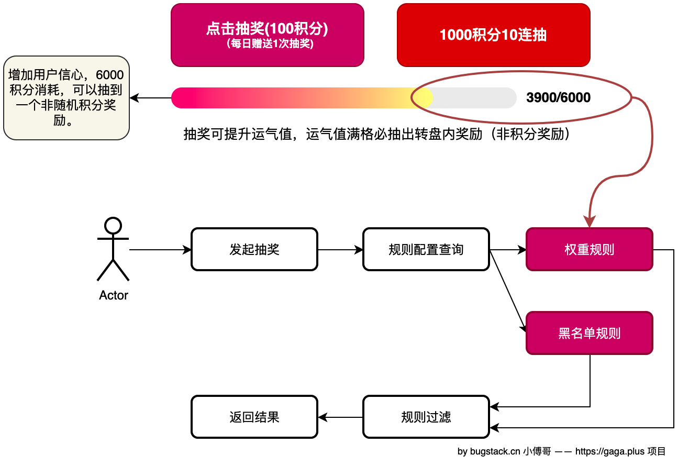

### 抽奖中置规则过滤

总结：根据**抽奖次数**设置不同的**抽奖范围**；抽奖次数越多，可能得到的奖品范围越大。

方法：在经过黑名单和策略权重后，执行默认策略时，首先获取抽取到的奖品，再对该奖品进行抽奖中过滤；若不满足规则，则发放兜底奖品。如图所示：

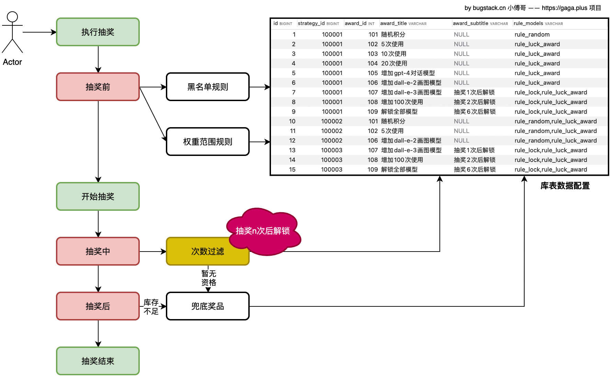

#### 业务述求

一般产品在运营一段时间抽奖系统后，就会思考🤔怎么能刺激用户更多的消耗手里的积分。频次更高的参与抽奖。这个时候产品就会从抽奖的行为上下手，比如；一个用户最开始前三次抽奖，能抽奖的范围为1-6个奖品，当抽奖3次后解锁1-7、抽奖6次后解锁1-9这样一个处理。那么用户已经抽奖一次，就会想着在抽奖下好增加抽奖奖品的范围。从而更多的消耗用户积分。

### 责任链模式处理抽奖规则

总结：使用**责任链**管理抽奖前的规则【黑名单规则、权重规则、默认抽奖规则等】；以便更好扩展和管理抽奖前规则内容。

方法：定义一个责任链装配接口【内部处理】，其中包含**next字段（下一个需要检查的规则）**；以及一个责任链调用接口【外部调用】，从第一个规则开始按照next尝试执行不同的规则。如图所示：

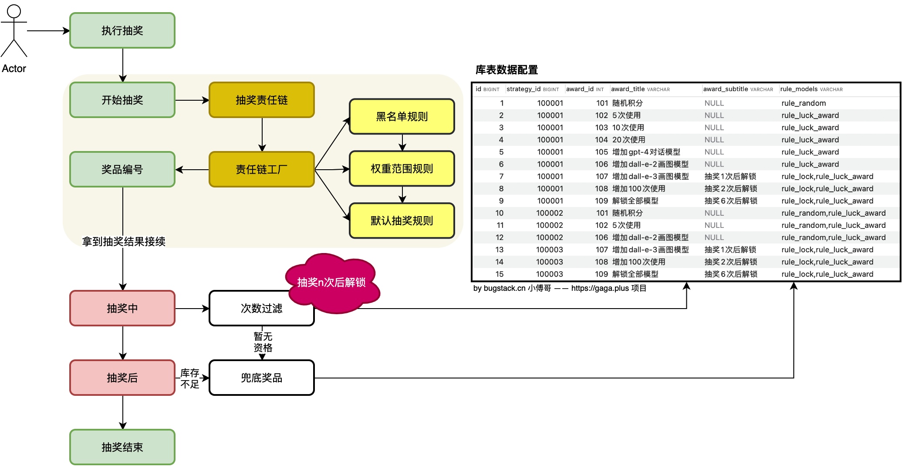

工厂装配：获取规则，并构建责任链。

#### 业务述求

在前面的章节中，我们运用了**策略模式、工厂模式、模板模式**，来完成抽奖流程的定义和抽奖过程前、中、后，规则的过滤处理。但在我们规则处理的流程中，因为前置规则的校验含带了抽奖的行为处理，这样绑定到规则流程实现中会显得有些臃肿，让规则负责的事情变得更多。所以在本节小傅哥会带着大家使用**责任链模式**进行优化完善，让整个代码流程变得更加清晰。

### 抽奖规则树模型结构设计（不是重点）

总结：使用**规则树**完成不同情况下的规则传递执行。

#### 业务述求

本章节需要引入新的设计模式结构，解决抽奖策略规则的中、后两部分执行问题。通过组合模式的规则引擎，让过滤节点可以满足一颗二叉树的结构，自由的组合和多分支链路的方式完成流程的处理。

### 模板模式串联抽奖规则

总结：将抽奖前的责任链和抽奖中、后的责任树进行**流程串联**；使用模版模式串联整个抽奖流程，如：抽奖前获得奖品，然后再执行抽奖中和抽奖后的规则，最后返回奖品即可。

#### 业务述求

通过模板模式，把上一节中规则树的结构设计，整合到抽奖过程中。这样整个抽奖策略过程会包括：责任链进行抽奖计算，基于抽奖计算结果对基础抽奖进行规则树的过滤，最终返回抽奖结果。

### 不超卖库存规则实现 

总结：使用**Redis**缓存奖品库存，解决超卖问题；使用**Redisson延迟队列 + 定时任务消费**，完成数据库内容更新。

【注意】：**首先对于库存集中扣减类的业务流程，是不能直接用数据库表抗的。**

方法：

- 库存消费：借助**Redis**，缓存奖品库存
- 数据库同步：库存消耗之后，更新库表内容：Redisson延迟队列 + 定时任务，缓慢消耗队列数据据来更新数据库表内容。

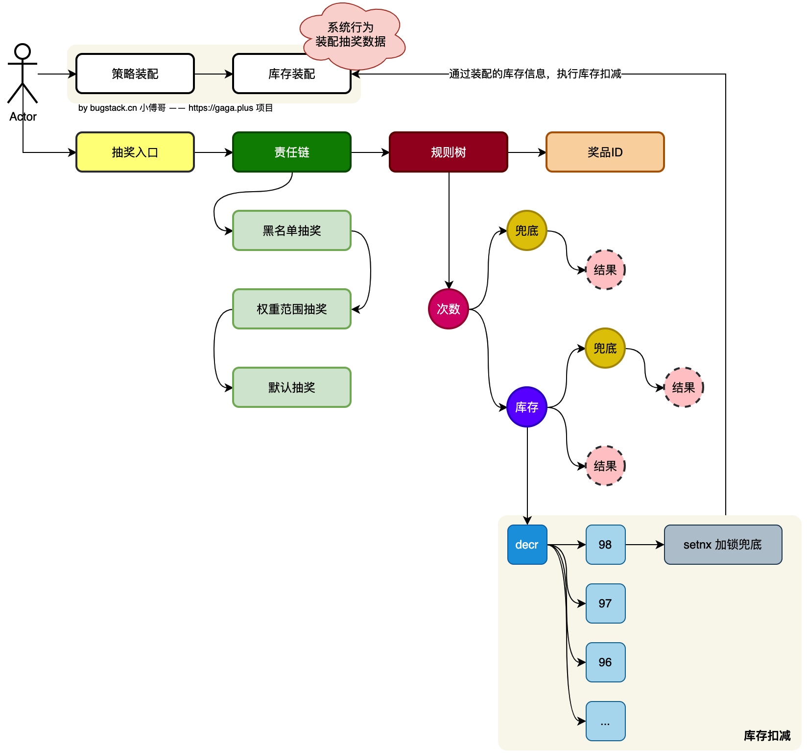

#### 业务

当通过抽奖策略计算完用户可获得的奖品ID后，接下来就需要对这一条奖品记录进行**库存**的扣减操作。只有奖品库存扣减成功，才可以获得奖品ID对应的奖品，否则将走到兜底奖品。

#### 具体步骤

库存扣减：

- 库存装配：首先访问数据库将库存缓存到Redis；

- 使用**decr**操作扣减库存（decr是原子操作）

  - 库存超卖问题：先尝试使用decr扣减库存，但扣减之后库存小于0，则重置Redis库存为0，并扣减失败。

  - 库存恢复/重买问题【数量从98->96,后面由于其他原因恢复到98，此时98已经卖出去了，不应该再被卖】：将`decr_数量值（如98)`作为一个key添加到Redis中，并使用**setnx**加锁；如果查询到该数值已经加过锁了，那么就不能再次消费；

- 扣减库存成功，则将该扣减动作加入到Redis的延迟队列；延迟固定/特定时间之后再写入队列中。
  - 延迟队列实现：使用Redis的延迟队列，并使用一个key标记该队列。

数据库同步：

- 定时任务（**Scheduled注解**）
  - 获取延迟队列内容
  - 队列存在内容则更新数据库库存

### 抽奖API接口实现

总结：添加一个api模块，将调用接口打包为jar，给调用方调用。同时，在trigger层面实现装配策略接口、查询奖品列表接口，随机抽奖触发接口等

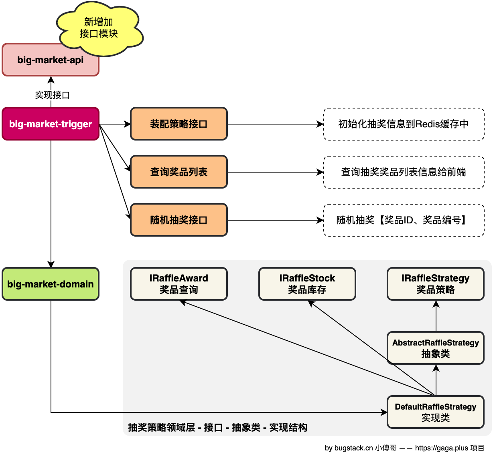

#### 业务述求

添加一个api模块，将调用接口打包为jar，给调用方调用。同时，在trigger层面实现装配策略接口、查询奖品接口，随机抽奖接口等

### 用户参与抽奖活动库表设计

总结：库表设计思路

【注意】

- 抽奖开始校验：查看是否存在之前未消费（抽奖未成功）的抽奖记录，若存在则继续之前的抽奖。

- 表设计：

  - 活动本身：
    - 活动信息表：开始时间、结束时间、库存总量、库存剩余、总参与次数情况、抽奖策略、状态（是否抽奖成功）
    - 参与次数表（包含所有抽奖情况）：次数编号、总次数、日次数、月次数

  - 用户与活动关联：
    - 用户参与活动记录：用户id、活动id、策略id、订单id、下单时间、状态
    - 用户活动次数情况：用户id、活动id、总次数、总剩余次数、日次数、日剩余次数、月次数、月剩余次数
    - 账户次数流水（记录用户次数变更）：用户id、流水id、活动id、业务id、次数编号

- 事务完成：需要联合查询多个表，当用户活动剩余次数不足时，用户参与活动记录就可以不修改等等。

- 分库分表：一对多时，可以将“多”的表拆分为多个子表；然后，将同一个事务内的表放置在同一个库中，防止跨库访问导致开销。

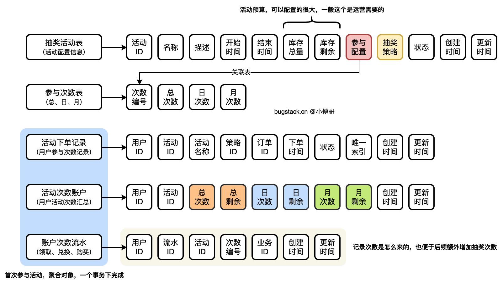

#### 业务述求

在一个营销场景中，抽奖的流程分为；参与的有效期、整体的预算库存、个人的可参与次数、之后是抽奖策略的计算处理，返回抽奖结果。

大营销第1阶段已经完成了抽奖策略的领域模块实现，接下来则需要设计一个外壳，把抽奖策略包装进去。这个外壳就是一个抽奖活动的配置，在活动上有相关的库存、时间、状态，个人在总、日、月分别可进行的参数次数判断。

### 引入分库分表路由组件

总结：分库分表查找/路由思路；学习**分库分表路由组件的编写**

【注意】

- 分库分表的理由：技术成熟、为以后的数据量预留扩展空间【数据量大】
- 分库分表的计算原理
- 配置类库表不需要分库分表，对于用户类行为可以分库分表（如：不同范围的用户分别存储在不同的库表中）

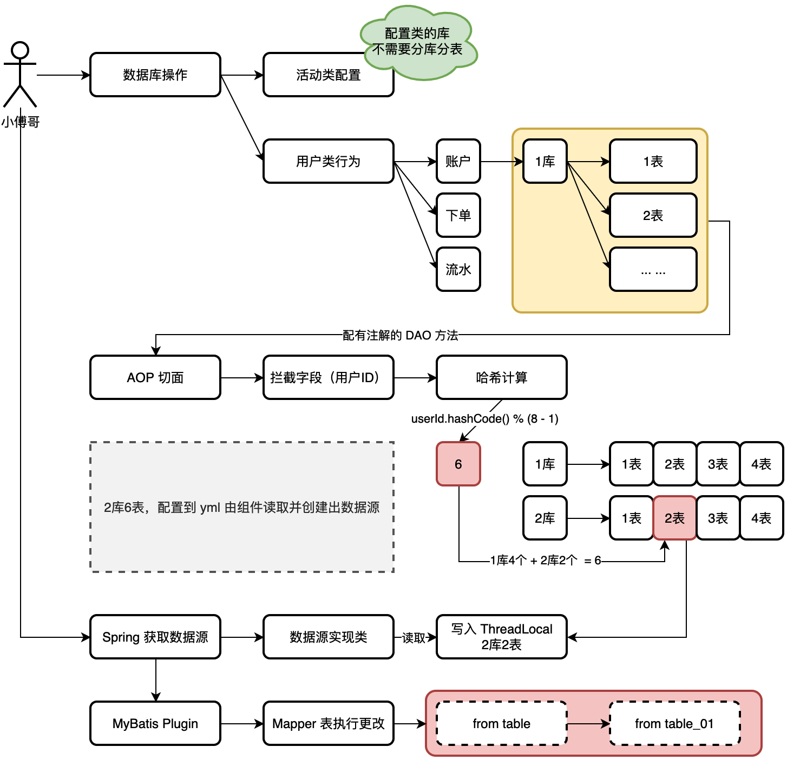

#### 业务述求

为用户的行为数据，使用路由组件将数据散列到分库分表中。

分库分表也是分布式架构中一个非常常用的数据存储方案，通常在公司中创建的系统都是直接创建出带有分库分表的系统架构。因为本身分库分表就是一个很成熟的方案，系统的分层和开发的熟练度都非常高。如果早期设计为单库单表的，那么后期再想扩展为分库分表则会有非常大的数据迁移和工程改造成本。

那么，分库分表以后，早期需要更多的数据库资源吗？其实并不用的，对于早期上线的系统，如果评估没那么大的体量，则可以使用虚拟机的方案安装数据库，也就是原来1台物理机，装1个数据库，现在则是2台物理机拆分为虚拟机，各个应用互相使用【作为主备】。而你占用的都是虚拟资源。也就是原来1台物理机等于5个虚拟机，现在5个虚拟机被分配到各个物理机上。所以你的分库分表并没有额外占用更多的资源。但这样的设计，业务体量上来以后，扩展只需要调整虚拟机的分配就可以了。

### 抽奖活动订单流程设计

总结：修改库表设计，区分不同行为（签到/支付/兑换等）导致的总、日、月次数变化，与抽奖活动表实现解耦。

修改原理：

- 调整前：活动库存=1000次，用户签到或支付都从这1000次扣减，无法区分行为。

- 调整后：

  - 抽奖活动表只负责抽奖活动的总体设计
  - SKU表负责抽奖次数，定义不同的行为获取不同次数，（签到获取1，转发获取 3次抽奖机会），并且拥有单独的库存
    - SKU1：签到奖励（库存99999，每次发1次抽奖）
      - 参与次数表：添加总次数、日次数、月次数均为1的数据
      - 活动sku表：添加代表签到的skuId、活动id、签到对应的次数编号、签到对应的单独库存总量与剩余库存。
    - SKU2：支付奖励（库存5000，每次发3次抽奖）

  - 抽奖活动表如同货架， SKU表则是该货架的商品，用户只需要购买商品，而不需要理会货架 -- 解耦

- 签到一次的过程：

  - 添加签到相关的参与次数表、活动sku表
  - 执行签到时，查看签到的sku表是否还有剩余库存；
    - 有则查看签到对应的次数编号，获取总次数、日次数、月次数内容

  - 记录活动下单流水：记录对应用户签到行为导致的总次数、日次数、月次数变化。
  - 修改活动次数账户：修改对应用户的次数、剩余次数数据

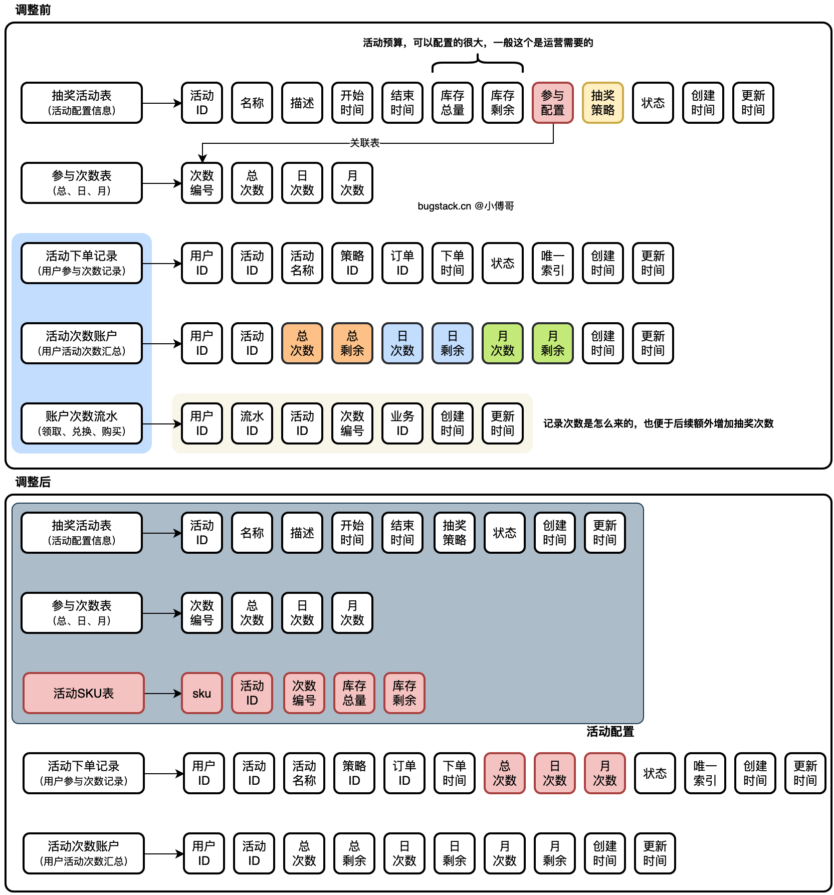

解释：

- 抽奖活动表：仅仅与抽奖活动的总体信息相关
- 参与次数表：每种行为导致的总次数、日次数、月次数**变化**。（如：签到导致总次数、日次数、月次数均变化1次）
- 活动SKU表：每种行为表示为一个SKU，对应一条数据。如：签到->sku1、抽奖活动id、对应的次数编号、签到单独的库存、签到剩余的库存。
- 用户活动次数汇总表：每个用户对应一条数据，记录用户对于活动id的次数和剩余次数。
- 用户参与次数记录：记录用户每次下单的流水。一次下单/签到等对应一条数据，其中总次数、日次数、月次数分别说明该次记录涉及的变化值。

#### 业务述求

本节我们要设计出用户参与抽奖活动的流程设计，并可以支持后续满足用户通过不同行为来增加自己的抽奖次数。

将前面所设计的活动表做一个解耦操作，满足后续流程个人可参与抽奖活动次数的变化处理。

### 抽奖活动流水入库

总结：使用外部提供的唯一防重复id提供幂等性保障；链式验证过程可以使用责任链；同时更新多个数据库需使用事务操作。

【知识点】

- 幂等：防止一个请求执行多次；添加一个**外部透传的唯一id【外部生成的id，跟随请求一同传输，相同请求，id相同，故可以区分不同请求】**并作为唯一索引值，对于同一个请求，该id一致，从而确保不会多次添加同一个请求的内容。
- 责任链：
  - 一个节点接口（next、appendNext）、一个节点行为接口(action)
  - 一个节点抽象类，实现节点接口内容
  - 多个节点行为实现类，继承节点抽象类；实现每个节点的行为内容，并通过`Component`注解添加实现类到bean
  - 工厂组装
    - 责任链拼接：获取每个节点行为实现类的map，并将每个行为实现类使用appendNext连接；
    - 提供责任链到外部：返回拼接后的责任链给外部调用。

功能流程：

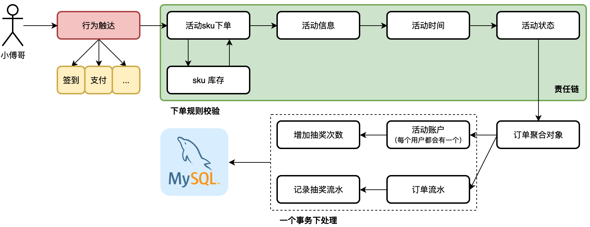

#### 业务述求

在基于活动、次数所组合的活动 sku，用户参与活动就相当于，下单sku给自己的活动账户充值可参与的额度次数。所以本节小傅哥就带着大家，把活动的下单的过程落入到数据库中。

本节写库会涉及到分库分表组件切分和开启事务的操作。

### 引入MQ处理活动SKU库存一致性

总结：使用RabbitMQ确保耗尽库存的最终一致性。

【知识点】

- 微服务：每一个子功能都作为一个系统，使用rpc socket通信。
- 趋势更新库存：延迟队列 + 定时任务

- RabbitMQ:用于库存消耗完之后更新数据库，保证最终一致性。
  - 定义消息模板：基础设施层定义消息模板（消息的字段和内容）
  - 发送消息API:基础设施定义发送消息api（publisher）
  - 创建消息并发送消息：领域模型创建消息并发布
  - 消费消息：触发层监听消息的发布，从而消费消息；调用基础设施层的dao来更新MySQL数据库。

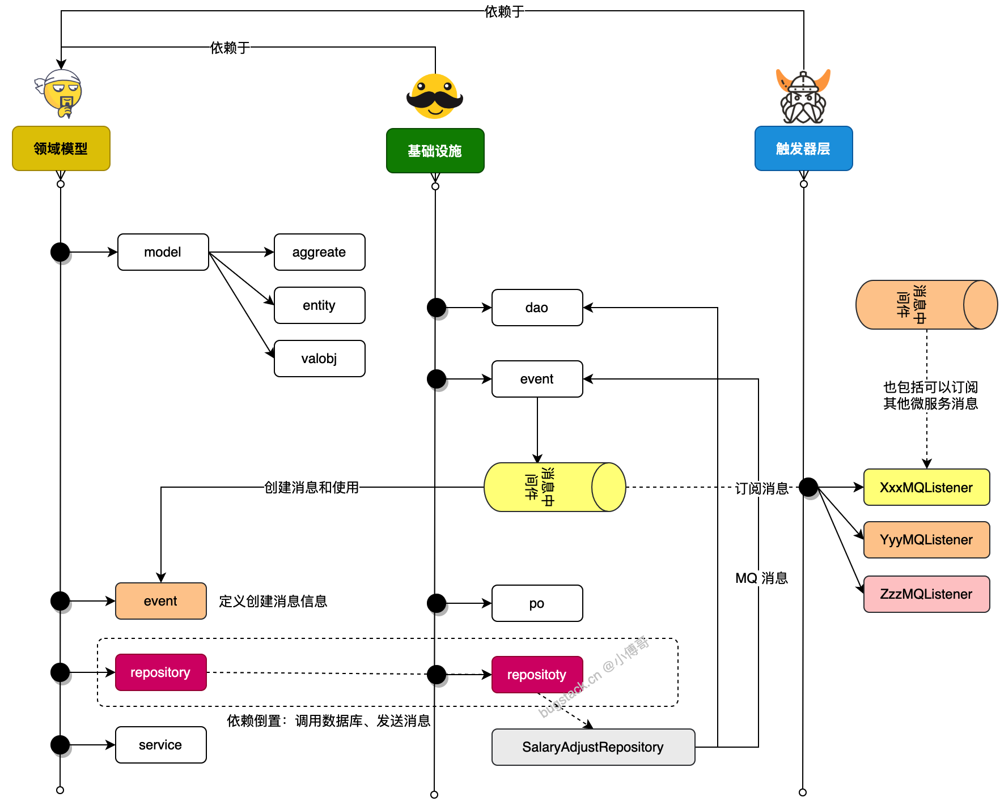

功能流程

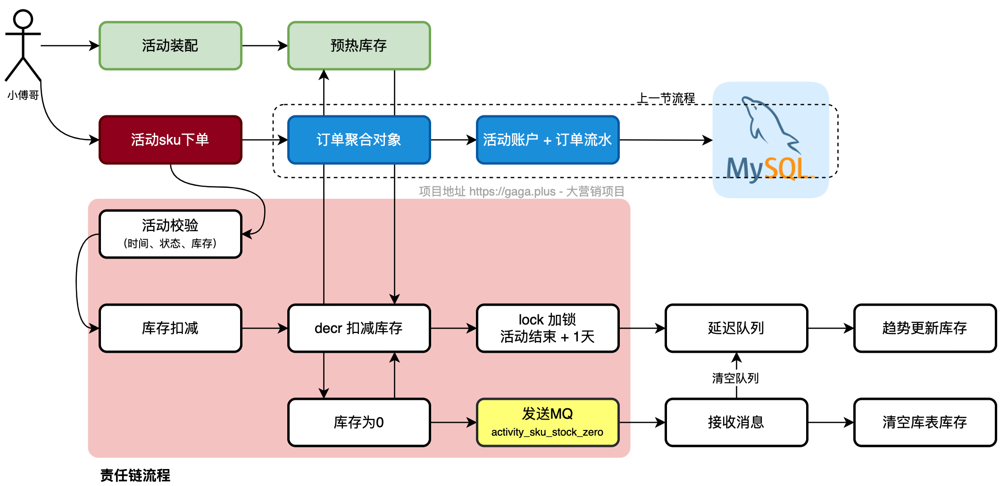

1. 第一步；完成责任链的活动校验，时间、状态、库存。
2. 第二步；对库存的扣减，使用 decr + lock 锁的方式（兜底）进行处理。
3. 第三步；做完库存扣减后，发送延迟队列，由任务调度更新趋势库存，满足最终一致。
4. 第四步；库存消耗为0后，发送MQ消息，驱动变更数据库库存为0

#### 业务述求

完成活动责任链判断，包括；活动的校验【日期、状态、sku库存】，之后是sku 库存的扣减操作。 之后这里会涉及一个缓存库存和数据库库存一致性问题，是本节要处理的重点。**一个手段是之前在策略实现阶段采用的延迟队列做趋势更新，另外一个是本节要引入 RabbitMQ 在库存消耗空以后发送 MQ 消息，直接更新清空最终库存，保持缓存与数据库的一致性。**

**注意**，可能此时缓存消耗库存阶段有失败丢失，不完全等于数据库真实库存。不过没关系，先保证一个统一库存即可。后续可以扫描统计订单数量，来校准库存。

### 用户领取活动库表设计

总结：用户抽奖库表，消费奖品。

业务流程
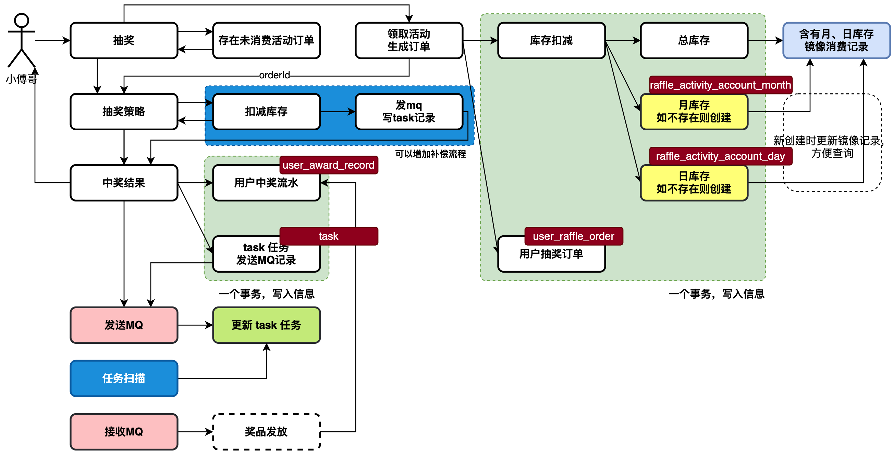

库表设计

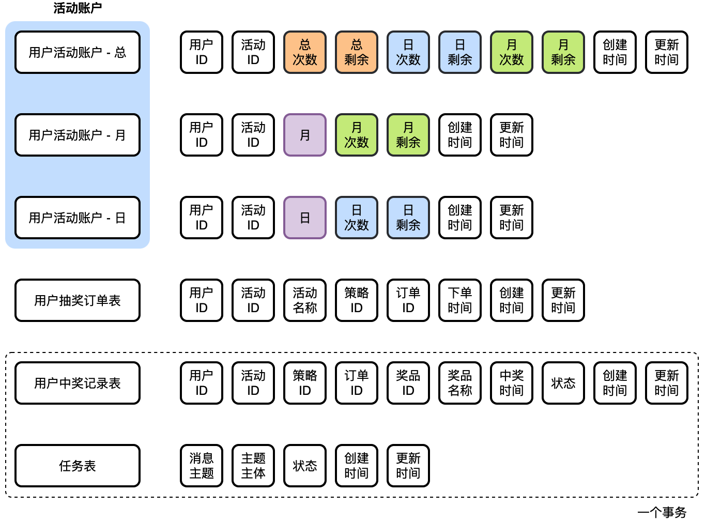

- 活动账户（月、日）：分别记录每日和每月参加的次数。每天一条记录和每月一条记录。
- 用户抽奖订单表：每个用户参与抽奖的时候产生的订单
- 用户中奖记录表：参与抽奖后获取具体奖品的记录表
- 任务表：用于保存和发送MQ消息。通过任务扫描发送，一种兜底设计。

#### 业务述求

设计用于，用户参与活动所需的库表。从用户参与活动，扣减个人活动账户次数，创建活动订单。抽奖完成获得奖品ID后，写入中奖记录和task任务表（发mq补偿使用）。之后发送MQ消息，更新中奖记录。

### 领取活动扣减账户额度

总结：用户账户的次数**扣减**流程。

【知识点】

- 聚合对象：一个事务对应一个聚合对象，将一个事务中涉及到的多个对象都放到一个对象中。

- 事务操作：
  - 更新用户次数的总次数、月次数、日次数库表
  - 添加用户参与消费的记录。

- DDD框架的Service层也可以根据不同的领域内容【增加用户次数、消费用户次数】进行分类

业务流程（添加用户次数库存扣减和记录）

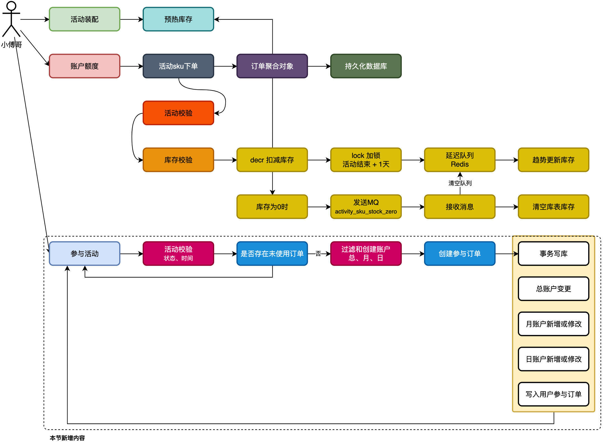

#### 业务述求

活动领域是一个含有活动部署、活动账户充值、用户参与活动的多个核心子领域组成，也就是一个活动下不只是有一个 service 服务。对于这样的情况，我们需要涉及出不同的子领域来承接这些功能。而不是把所有的功能都平铺到一个模块下。因为平铺写一堆的 service 的方式会让整个逻辑混乱，需求迭代的次数越多，最后的代码也就会越混乱。

所以本节我们要在添加扣减额度的需求上，对前面章节实现的活动sku充值，划分下领域。之后再进行新功能的实现。

### 写入中奖记录和任务补偿发送MQ

总结：MQ失败的补偿机制以及事务处理、线程池使用、service层的多个子领域划分。

【知识点】

- MQ的补偿：task任务表
- 异步发送MQ:使用线程池异步扫描task任务表以及异步发送task中的消息

业务流程

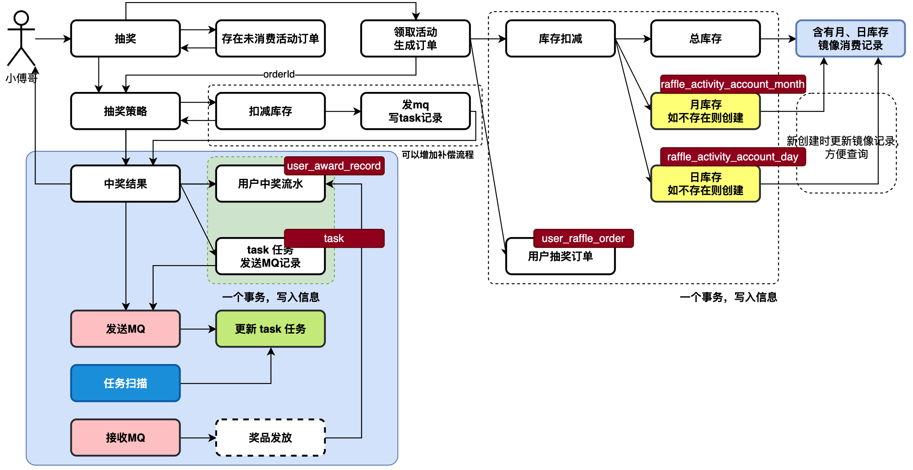

- 从用户中奖到发奖，通常来说我们会做异步解耦，因为一些奖品的方法并不是都是在抽奖系统，而是各种 RPC/HTTP 接口来发放，这些接口有些时候会有超时的问题，需要重试处理。所以需要数据库写入一条记录，之后记录一个状态。之后奖品真正发放完以后，在更新这个这个状态。
- 使用MQ发送消息，调用奖品发放接口来异步发放奖品；
- 使用task任务表来记录MQ消息，防止MQ消息失败

#### 业务述求

一整个抽奖过程先从活动账户额度充值、活动参与、抽奖执行【策略】，之后就是中奖记录写入和后续的发奖。那么本节要实现的就是这里的奖品记录写入和异步消息发送。

本节会用到 task 任务表，在写入奖品记录的时候，写入一条 task 消息发送任务，作为补偿使用。当 mq 发送失败的时候，则由任务扫描 task 消息进行发送。

### 抽奖活动流程串联

总结：将之前已经实现的接口和子模块写成一个流程/函数，作为API给外部调用即可；整合过程中，需要将写死的值写为查询数据库得到值。

业务流程

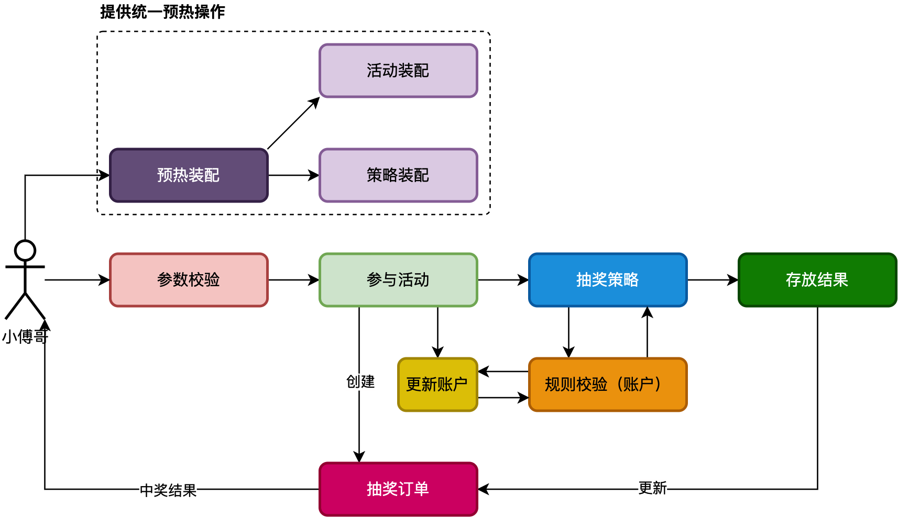

1. 开发内容1；串联整个抽奖流程，提供 API
2. 开发内容2；提供以活动为主导的，预热装配动作
3. 开发内容3；抽奖策略模块中，校验账户额度。【之前的一个策略规则，需要根据已经抽奖次数进行解锁】
4. 开发内容4；存放抽奖结果后，更新用户参与活动时的抽奖单状态为已使用。

#### 业务述求

到本节以抽奖为流程的各个领域模块已经开发完成，本章我们将**串联各个模块提供抽奖API接口。**

在一些较大规模的系统架构中，DDD 的分层结构中会有一个 case 层，也可以叫 application 层。专门用于对 domain 领域的编排。这一层引入后的优势是为复杂项目提供编排能力，提高领域模块的复用性。但缺点是会额外多出一组对象的转换来防腐，因为开发成本会有所增加。所以这部分要看具体的场景而定，看是否选择增加 case 编排层。

### 活动信息API迭代和功能完善

总结：完善奖品加锁（N次后解锁）、给抽奖策略的Redis添加过期时间、Redisson序列化、抽奖sku队列添加不同id，对不同的sku清除而不是清除所有sku

#### 业务述求

扩展查询奖品信息接口【queryRaffleAwardList】，以用户活动为视角进行查询增加返回信息。同时修复Redisson序列化、加锁过期时间问题。

### 用户行为返利入账

总结：用户行为可能触发多种返利奖励，其中过程涉及聚合对象、事务、MQ消息发送、task补偿MQ

业务流程

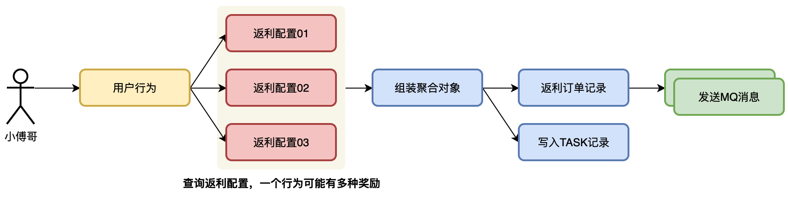

日常的返利会根据用户所完成的行为动作来触达，这包括：打卡、签到、连签、支付、开户、交易、信贷、拉新等各类的动作。我们本节中所涉及的，主要是日常的日历签到行为，并也从功能实现上扩展出各类型的任务，以便于后续扩展。

- 一个用户行为可能触发多种返利奖励，故组装聚合对象
- 一个聚合对象包含订单写入和task记录写入
- 发送MQ消息，会有task兜底

#### 业务述求

按照用户行为返利的需求设计，创建相应的库表，开发 rebate 返利领域，提供返利订单创建接口。并在写入订单后发送 MQ 消息。后续则处理奖励入账。

### 用户行为返利结算

总结：熟悉MQ消息结构以及发送、接受MQ消息的过程。

业务流程

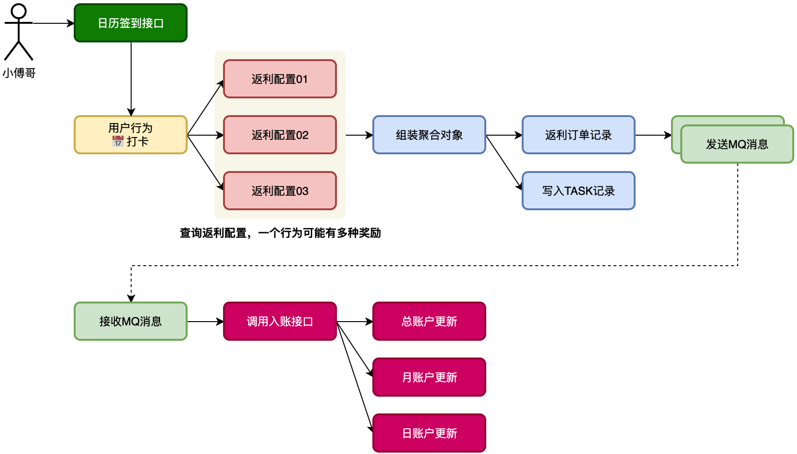

1. 增加接收MQ消息流程，调用活动账户额度入账接口，增加用户的可抽奖次数。这里包括；总、月、日，账户额度更新。
2. 注意 MQ 消息会有过滤，目前只处理返利是 sku 类型的返利。
3. 最后在提供一个日历签到的接口，便于后续对接到前端页面使用。

#### 业务述求

上一节对用户的行为根据返利配置进行入账发送MQ消息，这一节将接收MQ消息开始结算返利。这里也就是给用户的活动账户充值。并提供一个日历签到返利的接口，用于后续对接到前端UI

### 规则完善和应用接口实现

总结：增加查询奖品权重规则接口【 总共抽奖N次后必抽中奖品】、增加用户剩余次数查询接口、签到等查询接口。

#### 业务述求

完善权重规则的校验，用户的总抽奖次数作为规则权重的比对值，一个活动下抽奖总N次后，可获得必中范围奖品。之后提供出，活动账户额度、签到&查询、权重范围接口，用于前端UI渲染使用。

### 积分发奖服务实现

总结：增加一个积分中间内容，将前面对抽奖次数的操作修改为对积分的操作。

【知识点】

- 当需要使用大量if..else...来选择调用不同实现类时，可以使用`Map<String, Bean对象>`的方法来实现。根据String即可获取不同的Bean对象/实现类，从而执行不同实现类。

业务流程连接

[《大营销平台系统设计实现》 - 营销服务 第25节：积分发奖服务实现](https://articles.zsxq.com/id_7vh77fqlt5ki.html)

业务流程

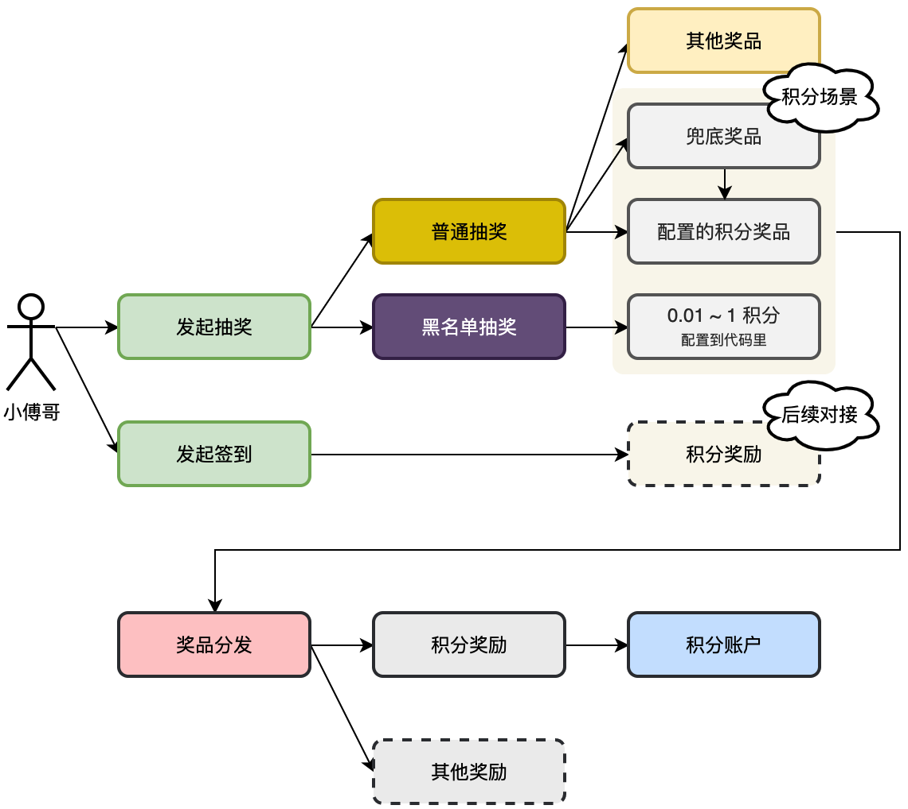

- 积分获取有4个流程，抽奖中有3个，包括：
  - 默认抽到积分商品
  - 抽取到其他奖品但无库存时，走积分兜底奖品
  - 配置黑名单用户，随机获取0.01~1积分
  - 发起签到，可配置积分奖励，后续实现签到发奖积分流程

- 实现奖品分发服务，发放用户积分奖励，到用户的积分账户表。积分账户表是本节新增加库表

#### 业务述求

设计用户活动积分流程，创建用户积分表，并开发用户抽奖积分奖品后，完成奖品发放流程，给用户增加积分。用户的积分是一种中间媒介，抽奖可以获取积分奖品，签到可以获取积分奖品，还可以用积分兑换活动抽奖次数。通过这样的方式把整个抽奖流程闭环。

### 积分领域调额服务

总结：添加积分调整子领域，可以增加和减少积分。

【知识点】

- Redis lock加锁：对个人用户的积分账户加锁，个人用户频次不高；同时加锁可以减少数据库并发压力。

业务流程

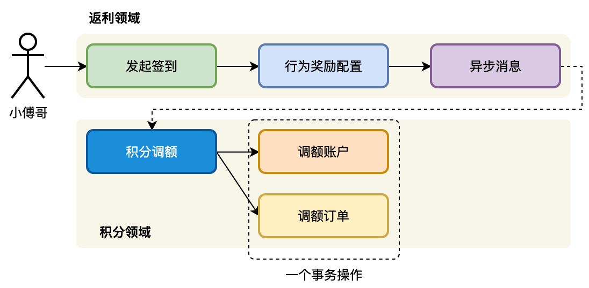

1. 首先，设计、定义和开发出积分领域模块，增加积分调额接口。
2. 之后，对接返利异步消息，完成积分额度的增加。

#### 业务述求

增加用户积分领域模块，开发积分调额接口。将增加/减少积分领域划分为子领域，并使用MQ异步消息触发积分增加/减少行为。

### 积分支付兑换商品

总结：商品下单（抽奖）使用积分支付，同时使用MQ消息将积分扣减和次数变更解耦，实现积分微服务程序。

业务流程

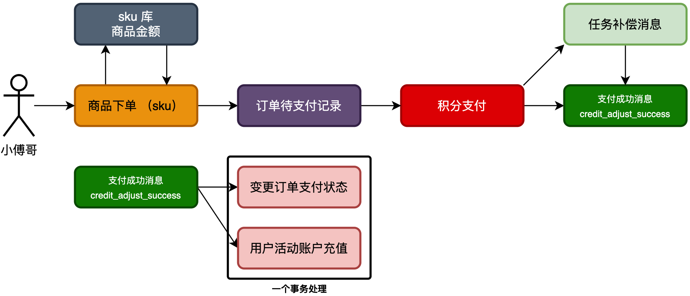

1. 首先，对 sku 商品库增加积分金额，用于积分支付，而签到兑换类则无需关注金额。
2. 之后，商品下单需要提供出交易策略：无支付交易和有支付交易。
3. 最后，下单完成则进行积分抵扣，以及接收到支付成功消息，进行充值入账。

#### 业务述求

开发扣减积分，兑换sku商品，所需的服务模块。让积分的获取、消费，形成逻辑闭环。

积分是衔接营销场景中各个功能模块的一个非常重要的手段，如；各项用户的行为 + 抽奖返利积分，积分兑换商品、积分兑换抽奖次数、积分支付抵扣、积分会员等级折扣等。【这些内容在你的日常使用各类互联网产品中，都会遇到的，可以留意下】

### 积分应用场景接口实现

总结：结合前端需求，提供积分查询和sku商品查询接口，以及一个积分兑换操作处理接口

【知识点】

- 兑换操作：创建下单商品时返回未支付订单，将下单到支付分为两个步骤。因为下单完成，支付时可能金额不足导致无法支付，但下单订单已成功创建，在后续时间中可以把未支付的订单查询出来继续支付。

#### 业务述求

以支持积分使用「商品、账户、兑换」对接前端诉求，在本节开发所需的接口。包括；串联前面章节中实现积分模块功能完成积分兑换case（串联的每一个服务都可以当做一个case看待，只不过我们的场景没有那么多，所以在工程搭建中去掉了单独的case模块，减少对象频繁转换）、sku商品查询、用户积分账户额度查询。

### 分布式动态配置活动降级

总结：使用**zookeeper**实现分布式系统中**类属性变更同步**，**动态变更**类的**属性值**。

业务流程

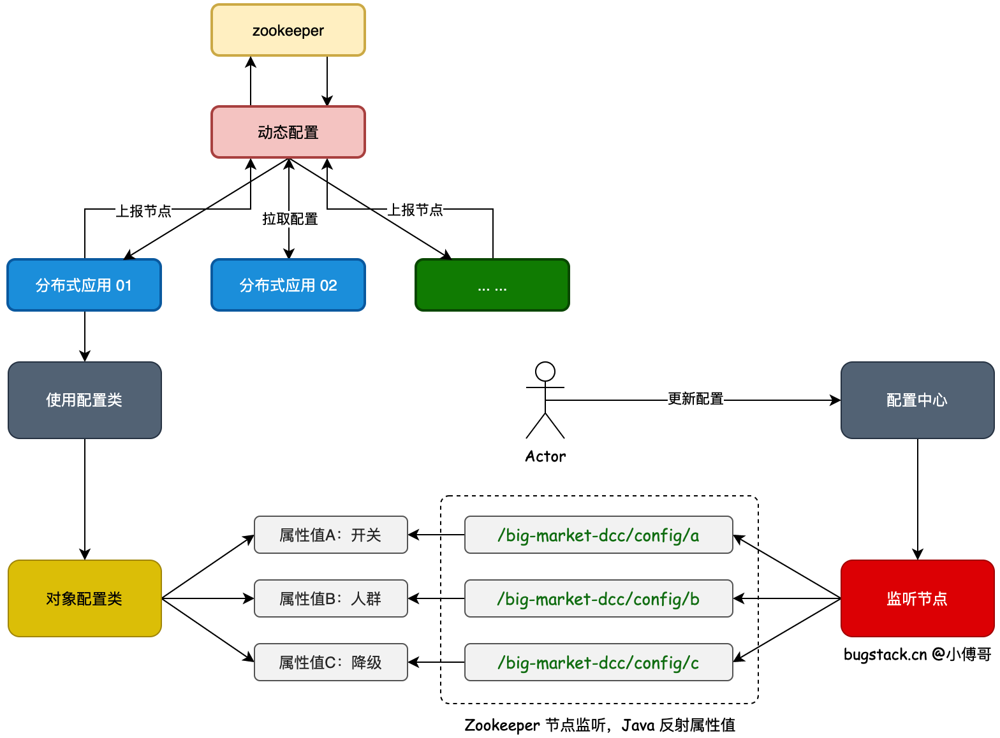

以Zookeeper为配置中心服务，基于 Zookeeper 的节点监听值变更机制，动态修改应用程序中属性值。

1. 首先，我们需要定义出一个 Zookeeper 监听的配置路径，一般这个路径在配置中心中是申请的系统使用地址，以确保值的唯一。
2. 之后，每个类对应的属性，需要映射出一个监听的节点。比如；Zookeeper 监听了 /big-market-dcc/config 那么类中 a 属性可以是 /big-market-dcc/config/a 这对这个路径设置的值，就可以被监听拿到了。
3. 最后，把获取到的监听值，通过 Java 反射操作，把值设置到对应的属性上。这样在 SpringBoot 应用程序中，使用某个类的属性值的时候，就可以动态的获取到变化的属性值了。

#### 业务述求

基于 **Zookeeper** 实现**分布式动态配置中心**服务，用于分布式应用节点系统中的环境属性值变更。这样我们可以让所有分布式系统中，类下的属性值做动态的调整，及时的对系统进行：切量、熔断、降级、黑白名单等用途。

### 分布式动态限流和熔断

总结：DCC动态控制限流开关，将用户写入到Redis中来实现限流；使用熔断组件实现熔断（？）

【知识点】

- DCC配置： 开启或关闭限流
- 限流：设置限流频次，当用户频繁访问N次后，会进入到Redis的黑名单中；在过期时间内，若用户位于Redis的名单上，则说明该用户被限流，故执行限流指定函数，而不是原本函数。
- 原始类获取：当原始类存在代理类时，需要更换获取原始类的方法。
  - `objBean.class()  ===》 AopUtils.getTargetClass(objBean)`

- 熔断：？

业务流程

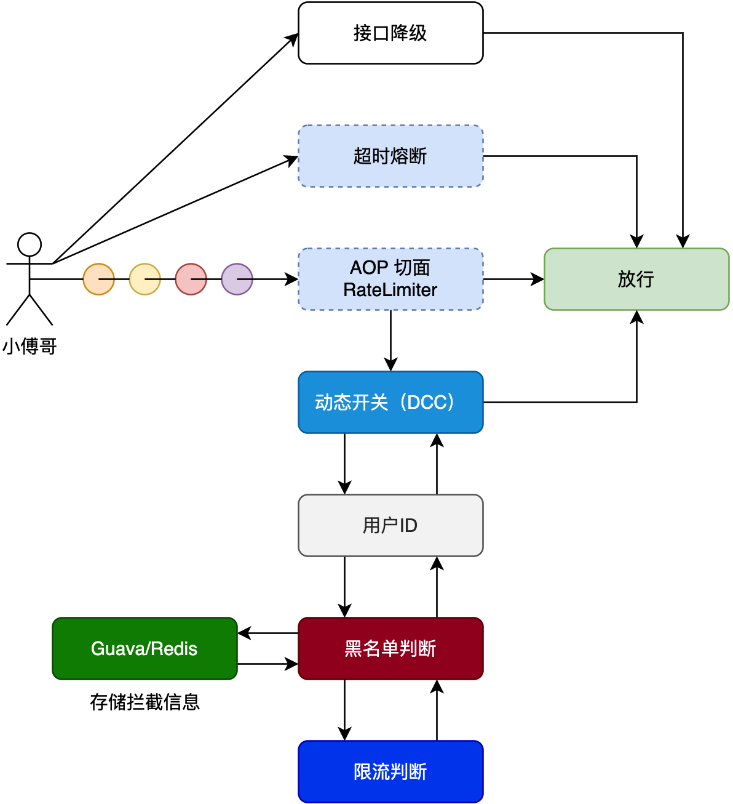

在上一节通过 Zookeeper 实现的动态配置中心 @DCC 服务下，对新增加 RateLimiter 动态限流黑名单服务提供控制管理。

1. 首先，因为我们引入切面了，那么上一节 @DCC 直接获取类操作属性的梳理就要考虑代理类的存在了。因为这时候被切面管理的类，在 Spring 中是一个代理对象，而不是原始对象，所以本节还涉及了 DCC 代码的处理。
2. 之后，本节要增加的是 RateLimiter 限流，当一个用户频繁访问超过N次后，则会将这个用户加入黑名单列表，不允许在访问当前服务。直至过了超时时间从黑名单列表移走后才允许访问。
3. 另外，本节还引入了接口超时熔断组件。降级、熔断、限流，这也是一套分布式微服务非常重要的手段。

#### 业务述求

增加动态**黑名单限流**组件，通过访问动态限制将限流用户24H存入**本地缓存**，通过统一 Dcc 全局配置控制使用。并在方法上引入接口超时**熔断组件**。这两个东西都是分布式架构场景非常常用的手段。也经常在面试中提问，你的接口是如何保证**可用性**的，有什么手段对**频繁**访问的用户做出**拦截**处理。以及超时后的处理。

### 分库分表数据同步ES

总结：汇总分库分表的内容到ES，实现聚合查询

【知识点】

- ES：
- 分库分表同步：

组件介绍

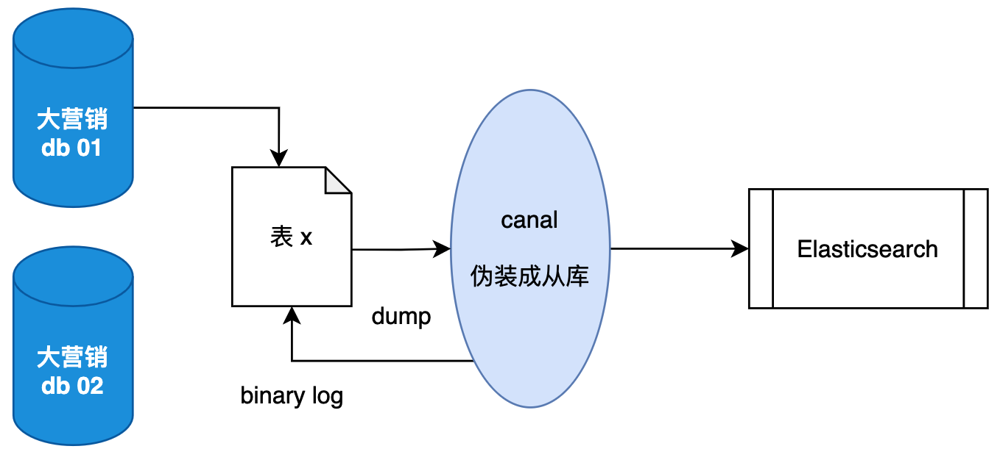

canal ，译为水道/管道/沟渠，主要用途是基于 MySQL 数据库增量日志解析，提供增量数据订阅和消费。

早期阿里巴巴因为杭州和美国双机房部署，存在跨机房同步的业务需求，实现方式主要是基于业务 trigger 获取增量变更。从 2010 年开始，业务逐步尝试数据库日志解析获取增量变更进行同步，由此衍生出了大量的数据库增量订阅和消费业务。

它的工作原理是，canal 模拟 MySQL slave 的交互协议，伪装自己为 MySQL slave ，向 MySQL master 发送dump 协议。在 MySQL master 收到 dump 请求，开始推送 binary log 给 slave (即 canal ) 这样 canal 再解析 binary log （binlog）进行配置分发，同步到 Elasticsearch 等系统中进行使用。

那么有了 canal 就可以把分库分表的数据同步到 Elasticsearch，提供汇总查询和聚合操作，也就不需要轮训每个分库分表数据了。

#### 业务述求   

对于C端的场景来说，我们经常会采用分库分表的方案承载数据流量的压力，以用户ID为切分键，让用户的行为数据分散到各个库表中。那么在C端除了给用户提供数据服务以外，还需要给运营提供数据，但分库分表后的数据都已经散列到各个库表了，对于聚合查询就变得复杂，所以我们还需要另外一套方案。就是把分散在各个数据库表的数据，通过使用 canal 组件，基于 binlog 日志，把数据同步到 ElasticSearch 文件服务中再提供使用。

### ES-ORM多数据源配置使用

总结：配置mybait使用多数据源，同时调整文件结构。

【知识点】

- 多数据源使用：通过配置Mybaits对应不同的mapper文件来指定sql语句使用不同的数据源

业务流程

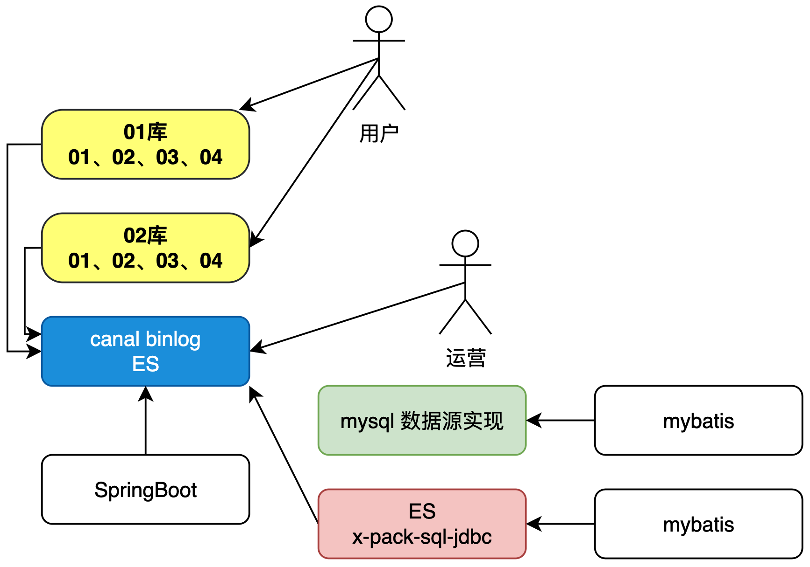

1. 分库分表是对C端用户的，所有的C端行为一定是有用户ID的。
2. canal 同步 ElasticSearch 是为了给运营端做数据聚合查询的，一般这类的查询是不做核心业务的，因为同步是有时效性的。

#### 业务述求

首先是目前已经在 MySQL 分库分表使用的基础上，加入了 canal 组件通过 binlog 日志把分库分表的数据同步 ElasticSearch 文件系统，那么接下来我们就需要让应用程序可以从 **ElasticSearch 查询数据**。也就是如何处理一个应用中多数据源的使用，同时要简化使用。另外因为工程的基础设施层越来越多内容了，我们要一点小的结构调整。

### xxl-job分布式任务调度

总结：xxl-job是一个分布式任务调度器，主要负责分布式场景中**定时任务、MQ补偿**等任务（job）的调度和设置。

【知识点】

- 分布式锁：对每个job【MQ补偿】添加分布式锁，防止MQ消息多次消费，出现多余的库扫描。
- XxlJob注解：`@XxlJob("UpdateActivitySkuStockJob")`；将分布式的`UpdateActivitySkuStockJob`方法交给Xxljob调度处理，当需要调用该方法时，会根据xxlJob的设置来进行调用。

业务流程

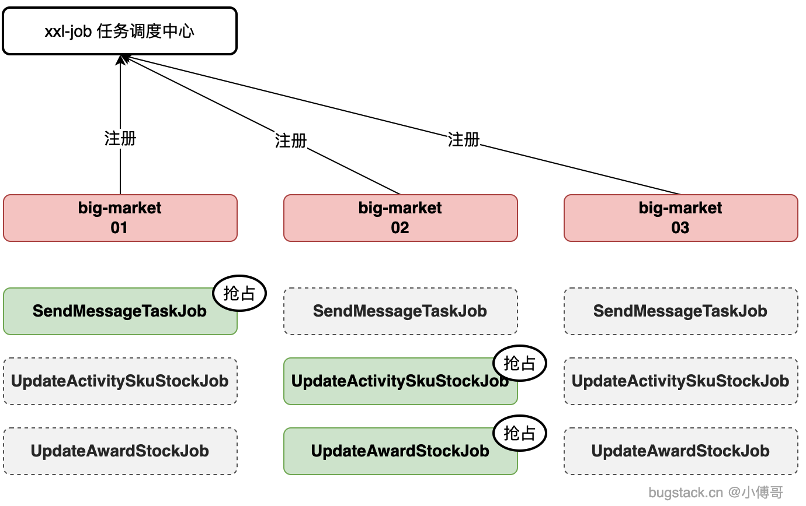

XXL-JOB 是一个轻量级分布式任务调度平台，其核心设计目标是开发迅速、学习简单、轻量级、易扩展。现已开放源代码并接入多家公司线上产品线，开箱即用。

1. big-market 01、big-market 02、big-market 03，举例分布式部署，也可以是更多的部署实例。
2. 每个应用实例都是相同的任务，这些任务增加了 **redis 分布式锁**抢占，避免所有任务都被同时执行。加了锁以后，同一时间只能一个实例上执行任务。
3. 但不能为了只有一个执行而部署一套，部署多套的用途是为了**互备**，如果一个挂了还有其他的任务可以执行。这个就是分布式架构高可用的设计思路。

#### 业务述求

增加 xxl-job 分布式任务调度服务，处理大营销中；发送MQ消息任务队列、更新活动sku库存任务、更新奖品库存任务定时任务。同时因为整个大营销是分布式部署，一套 big-market 会被多个应用实例一起部署，那么就会有多个实例上相同的一个任务要执行，这个时候需要增加抢占式锁，避免造成重复执行。重复执行可能导致无效的扫库或者重复发送MQ消息。

### 增强抽奖算法策略

总结：多种存储抽奖概率算法和查找方法

【知识点】

- 多种存储抽奖概率算法：
  - O(1):使用list存储每个数字，乱序后转为map【数据范围量小】
  - O(logn)：保存边界，并循环对比查找。【数据范围量大】

方案设计

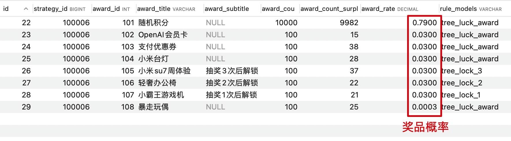

如图，8个奖品概率。1个0.79、6个0.03，1个0.0003，总概率和不是1。对于这样的一个可设定不同范围值的抽奖，怎么做研发方案呢？怎么让做的这个方案可以支撑不同概率类型的大规模抽奖呢？

在实际生产场景中，运营的奖品配置概率有时候百分位或者千分位，也就是小数点后有几个0，但有时候也有需要配置到万分位或者百万分位，来降低大奖的奖品概率配置。

对于不同概率的抽奖配置，我们也有为它设计出不同的抽奖算法策略。让万分位以下的这类频繁配置的，走O(1)时间复杂度。而对于超过万分位的，可以考虑循环对比，但在循环对比的中，还要根据奖品的数量设定出不同的计算模型。如；O(n)、O(logn) 如图；

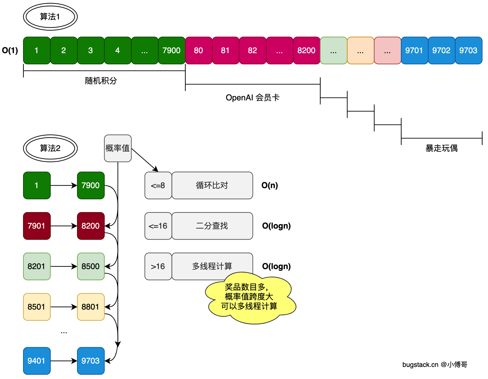

- 算法1；是O(1) 时间复杂度算法，在抽奖活动开启时，将奖品概率预热到本地(Guava)/Redis。如，10%的概率，可以是占了1~10的数字区间，对应奖品A。11~15 对应奖品B。那么在抽奖的时候，直接用生成的随机数通过对 map 进行 get 即可。

- 算法2；是O(n) ~ O(logn)算法，当奖品概率非常大的时候，达到几十万以上，我们就适合在本地或者 Redis 来初始化这些数据存到 Map 里了。那么这个时候就要把奖品概率，拆分为一个个有限定范围的格子区间。比如 1~7900代表一个奖品、7901~8200代表另外一个奖品，把这些数据存储到 `Map<Map<Integer,Integer>,Integer>` 在抽奖的时候通过产生的随机值来与这些范围区间依次进行对比。那么为了更好的优化抽奖算法，可以的分别对<=8的进行for循环、<=16的二分查找、>16的进行多线程计算。因为熟练很小开启多线程的资源也是一种消耗。

#### 业务述求

提供多种抽奖的装配算法和抽奖实现算法。

## 问题

### Redis如何存储数据？Redis的key是否了解？

### 库存超卖如何解决？decr又是什么？

### Redis消费奖品，如何更新到数据库？延时队列的原理？

### Scheduled注解作用？（定时任务相关）

- 作用：为方法添加定时任务功能，支持按固定间隔、延迟或**Cron表达式**触发执行。
- 注意事项：
  - 默认**单线程**执行定时任务，耗时任务会阻塞后续任务，需配置**线程池。**
  - 轻量级任务用 `@Scheduled`，复杂场景用 **Quartz**。
  - 任务方法时间过长，拆分为异步任务。（`@Async`）。

`@Async`注解：

- 使用 **动态代理** 拦截，在调用方法时，使用拦截器将方法封装为异步任务提交给**线程池**执行。

### DDD框架的理解？与MVC框架的区别？DDD优势？

### 雪花算法的原理？

作用：随机生辰唯一索引 id，防止被他人知道数据库的数据量或数据id

### 事务模板？ TransactionTemplate?

### RabbitMQ的发送和消费原理?使用RabbitMQ确保数据耗尽时最终一致性，为什么还需要延时队列 + 定时任务？RabbitMQ消息的优势？为什么发MQ

消费类型：基本消息、广播消息、路由消息、通配符消息。

### Springboot 中bean处理、bean工厂？

### 自定义注解？

### 分布式服务降级？熔断?限流？

### ES?如何查询价格范围？

### Springboot的install?打包生命周期？

### Mybaits搜索ES?